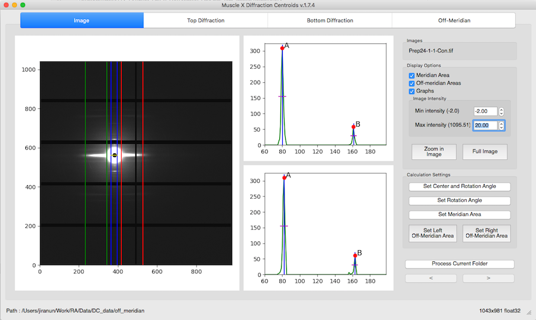

# Introduction

The meridian of the fiber diffraction pattern from muscle consists of families of so-called meridional reflections arising from the myosin packing in the thick filament (43 nm repeat), actin in the thin filaments (2.73 nm inter-subunit repeat), Troponin in thin filaments (42.x nm repeat) and myosin binding protein C (~ 45 nm repeat). Some of these reflections are bunched together in clusters, particularly around the position of the first and second (M1 and M2) myosin meridional reflections. Others are more spread out into well-separated peaks e.g. the 3rd order myosin reflection at 14.3 nm (m3), the 6th order at 7.2 nm (m6), the 15th order myosin reflection at 2.82 nm (m15), the first and second actin meridional reflections at 2.73 (a1) and 1.31 nm (a2) respectively, and the 3rd order Troponin reflection at ~12.8 nm. Small changes in the spacings of the m15 and a1meridional reflections have been used to measure the extensibility of the thick and thin filaments in situ (Huxley et al., 1994).  In addition, the relative spacings of the inner part of the 5.9 and 5.1 nm layer lines from actin have been used to measure relative twisting in the thin filaments (Wakabayashi et al., 1994).  

Diffraction Centroids is designed to rapidly and accurately measure the spacings of user specified meridional reflections as well as the 5.9 and 5.1 actin layer lines in a series of diffraction images, such as those generated in a time resolved experiment. The peak profiles in integrated intensity traces along the meridian are often not well modeled by standard functions such as gaussians or voigt functions and may change shape during the course of an experiment. Following Huxley et al., 1994, the spacing of the reflection is estimated as the centroid of the top half of the diffraction peak as an unbiased measure with minimal effect of noise. In this process, a peak width and height is estimated allowing calculation of its integrated intensity using a triangular approximation. Once the desired peaks and approximate locations have been specified by the operator, an entire directory of images can be processed without user intervention.

### More Details
* [How it works](Diffraction-Centroids--How-it-works.html)
* [How to use](Diffraction-Centroids--How-to-use.html)