# How to use

Equator has 2 modes: Interactive mode and Headless mode. User could choose either mode at their own convenience.

## Interactive Mode

Once the program run, you will see an input file dialog, so you can select the file you want to process. If you want to process multiple files in a folder, please select a file in that folder, and click “Process Current Folder”.

When the processing window opened, there are 3 tabs on the top, 
* [Image](#image)
* [Fitting](#fitting)
* [Results](#results)
* [Parameter Editor](#parameter-editor)

### Image
In this tab, you will see the selected image, Display Options section, and Image Processing section, a Reject check box, and Navigation section.

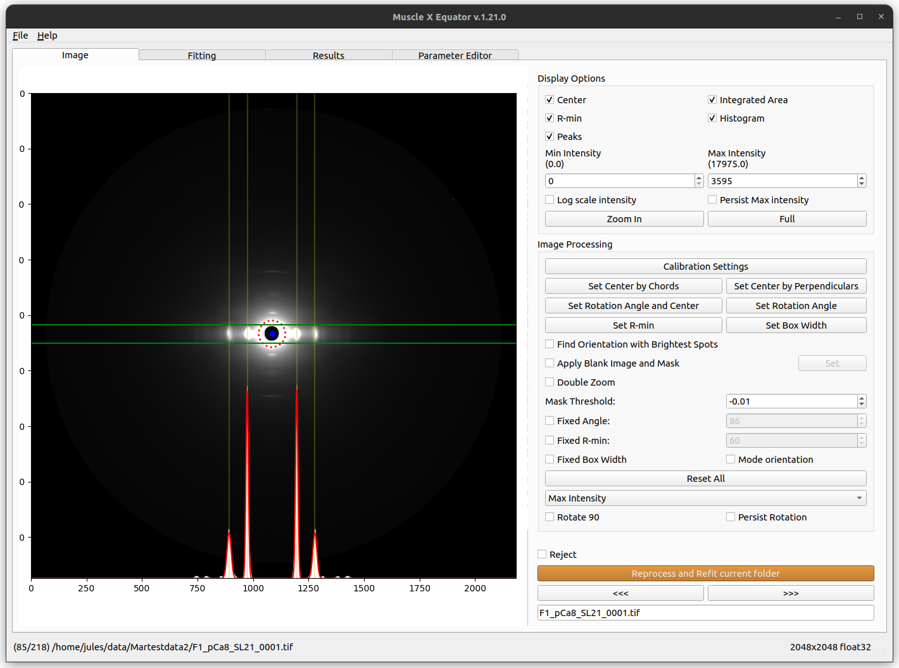

#### Display Options
In Display Options section, you are able to select what you want to see in the image. All check boxes are all about displaying information in the image. In image above, 
* Center : blue dot 
* Integrated Area (Box Width) : green lines
* R-min : red dotted circle
* Histogram : white plot as original histogram and red line as fitting model
* Peaks : yellow lines

The check box 'Persist intensities' is used to persist the max and the min intensities when we move to the next image.

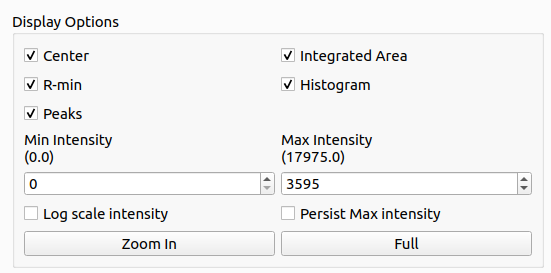 

You can also set min and max intensity for displayed image in this section. To zoom the image, you can click “Zoom In” button and select the zoom in area in the image, or using mouse wheeling in the image directly. This options in this section will not affect the image processing.
#### Image Processing
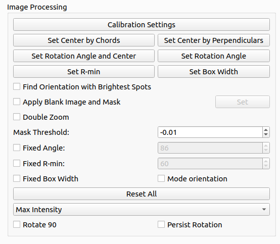

In Image Processing section, you will see multiple buttons allow you to calibrate the image and set some properties manually.
##### Calibration Settings
After “Calibration Settings” is pressed, there’s a window popped up. This window will allow you to select the calibration image by clicking on Browse or setting parameters manually. See [Calibration Settings](../Calibration-Settings.html) for more details

##### Set Center By Chords
Before setting center by chords, it’s better to zoom the image to the area of the diffraction because it will be easier to set these parameters correctly. This method is used to find the diffraction center and uses the fact that "All perpendiculars to the chords in a circle intersect at the center". On clicking this button, you will be prompted to select points along the circumference of the diffraction patter. As you select these points, perpendicular lines to the chords formed using these points start to appear on the image in blue color.  Once you finish selecting the points, click the same button again to start processing. The diffraction center will then be calculated by taking the average of the intersection points of the perpendicular lines (blue lines in the figure). 

##### Set Center By Perpendiculars
Before setting center by perpendiculars, it’s better to zoom the image to the area of the diffraction because it will be easier to set these parameters correctly. This method finds the center of diffraction using intersection of perpendicular lines. On clicking this button, you are prompted to select multiple positions in the image. You can start by clicking the first reflection peak on one side of the equator and the second will be the corresponding (opposite) reflection peak on the other side of the equator. This forms one horizontal line. You can continue drawing as many horizontal lines using this process of selecting reflection peaks. Next, you can click the reflection peak vertically above the equator and the following point symmetrically below the equator. Again, you can draw multiple such lines. Once you finish selecting the points, click the same button (Set Center By Perpendiculars) again to start processing. The diffraction center will then be calculated by taking the average of the intersection points obtained by the horizontal and vertical lines plotted. 

##### Set Rotation and Center
Before setting manual rotation and center, it’s better to zoom the image to the area of the diffraction because it will be easier to set these parameters correctly. To set the rotation and center, you need to click 2 positions of the image. The first one will be a reflection peak on one side of the equator, and the second one will be the corresponding (opposite) reflection peak on the other side of the equator. To cancel, press ESC. 
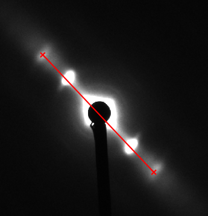

##### Set Rotation Angle
This assumes that the center of diffraction is correct. After the button is clicked, the program will allow users to select an angle by moving a line. Clicking on image when the line is on the equator of the diffraction will set manual rotation angle. To cancel, press ESC. (Make sure that “Fixed Angle” is not checked) 

##### Set Manual R-min
After the button clicked, you will see the red circle when you move the cursor around. To set manual R-min, please click on image when the circle size is the size of R-min you want. To cancel, press ESC. 
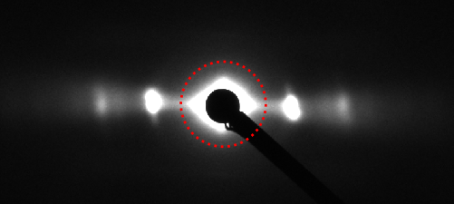

##### Set Box Width (Integrated Area)
To set the integrated area, you need to click 2 positions of the image. The first one will be the start line, and the second one will be the end line. To cancel, press ESC. 

##### Blank image and Mask
See the [Blank Image and Mask](Blank-Image-and-Mask.html) documentation for more information on how to use this option.

##### Fixed Angle
This feature will allow users to fixed rotation angle for every image which has not been processed. After the checkbox is checked, the manual rotation angle which is set by buttons will be ignored.

##### Fixed Box Width (Integrated Area)
This feature works in the same way as fixed angle, but the fixed value will be start and end position (pixel) of the box

##### Double Zoom
This feature is used to zoom into subpixel level accuracy. On checking this box, a new subplot is created on the top right of the image. As you move the mouse pointer into the image area, 20 x 20 pixels centered at the location of the mouse pointer is cropped from the image and scaled up to 10 times and plotted in the subplot mentioned earlier. This feature can be used with any calibration feature (Set Rotation, Set Center and Rotation...). Click the double zoom check box so that the subplot appears. Click on a calibration button, for example the Set Center and Rotation button. Drag your mouse pointer to the position you want to select the first point (or the first reflection peak as described earlier). Click the image to freeze the subplot region. A message appears, check do not show again box to not see this message again. Click on the exact point in the subplot region, which plots an equivalent point in the main image. Perform the previous two steps to select the second point. Uncheck the Double Zoom checkbox to hide the subplot window. 
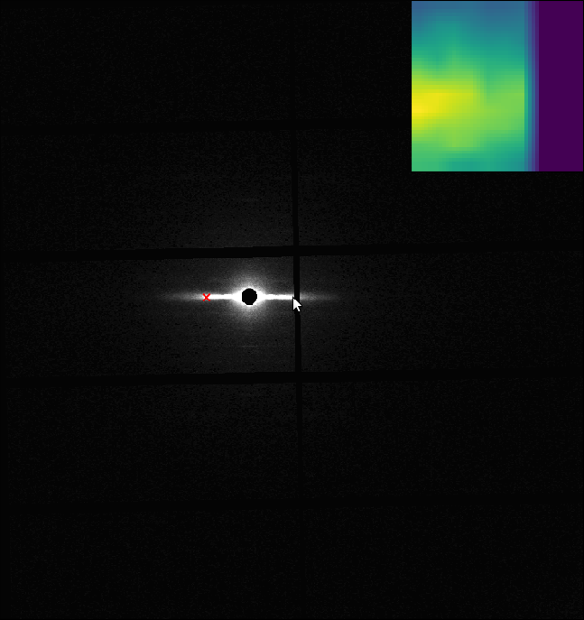

##### Mode Orientation
This checkbox can be used after fitting all the images in the folder. When checked, the rotation angle used would be the mode of the rotation angles of all the images in the folder. This is persisted when we move to the next image.

##### Expand the image

By default images are processed the way they are originally. If you check this checkbox, the image will be expanded so that the center of the beamline is at the center of the image. This can be useful for sensors like EIGER where the center is sometimes offset in order to avoid the gaps. The downside is that it makes the images bigger and thus heavier. If your computer has limited resources, checking this box might make the processing slow (bigger image to process).

##### Save Compressed Image

When this box is checked, the image saved is a compressed TIFF image. Its size is smaller but some other software might not be able to open them: fit2d will not accept this format, but imagej will.

##### Save Cropped Image (Original Size)

This checkbox is similar to "Expand the image", the only difference is that the image can be processed as an expanded image, and only saved as a cropped image.

#### Reject CheckBox

This checkbox is here to "mark" images as rejected when the fitting did not work. In the summary.csv, the rejected images won't have results saved and will have the word "REJECTED" in the comment section.

#### Navigation

To navigate through a folder of TIF images or through an H5 file containing multiple images, you can use the simple arrows "<" and ">". 
Depending on if you are looking at an H5 file or not, another set of button will be displayed: the arrows "<<<" and ">>>" allow you to go to the previous/next H5 file in the same folder. The "Process Current H5 File" button will process only the opened H5 file, whereas the "Process All H5 Files" button will process all the H5 files available in the folder.
In the case of a simple TIF image, those buttons will be replaced by a simple "Process Current Folder" button that will process all the TIF images in the current folder.

### Fitting
In this tab, you will see the graph produced from the intensity histogram in the integrated area, and fitting information. 
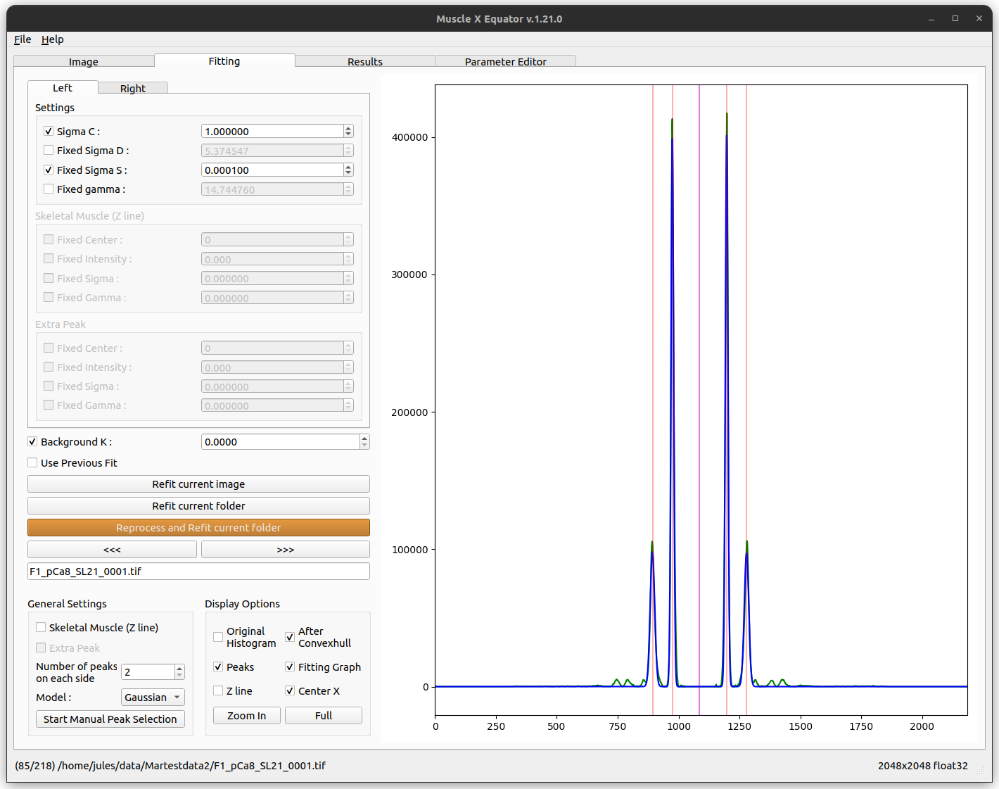

#### General Settings
In the section, you are able set necessary parameters for fitting process including skeletal muscle checkbox, extra peak checkbox (second Z line), number of peaks on each side, and fitting model. The model functions for the peaks currently supported are Voigtian and Gaussian. If the Number of Peaks selected are more  than the number of peaks, the program still tries to fit the model with the selected Number of Peaks.

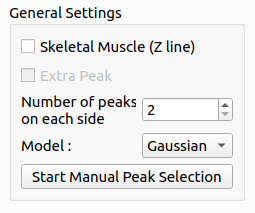

In cases where the program misplaces the peak locations, you can do peak selection manually by clicking on “Start Manual Peak Selection”. After the button clicked, you can select the how many peak locations you want by clicking on the graph. However, it's sufficient to just select S10 of left and right side. Click “Done” when you are done. To cancel, press ESC.

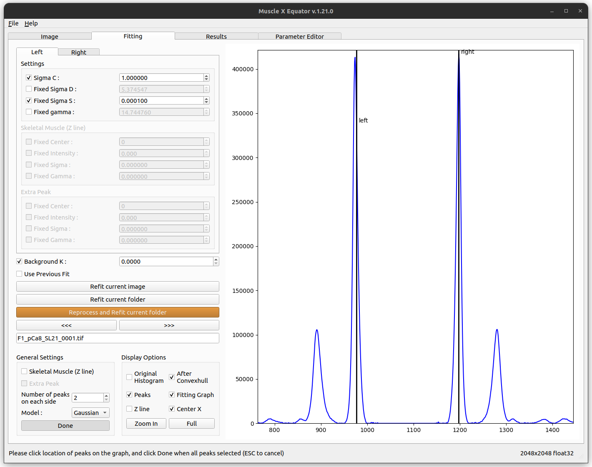

#### Display Options
In this section, you will be able to select what you want to see in the graph. All check boxes are all about displaying information in the graph. In the image above, 
* Original Histogram : black line
* After Convex hull : green line
* Peaks : red lines
* Fitting Graph (Best fit function graph) : blue line
* Z line : yellow line
* Center X : magenta line

You can also zoom-in to see more detail by the same mechanism as in Image tab. All options in this section will not affect the fitting results.

#### Settings
In this section, once a setting is changed, the fit will be recalculated. You can manually configure and lock all parameters of fitting model including Sigma C, Sigma S, Sigma D, gamma and skeletal parameters (Z line and extra peak). These parameters are independent on each side, so you have to choose the side by choosing left or right tab before setting these parameters. Press "Re-fitting" when you want to re-fit with the new settings.

Diffraction data taken on integrating detectors such as CCD detectors will have read noise. This can result in a constant offset to the background subtracted diffraction peaks from zero. This can lead to systematic error("BAckgeos in your peak measurement. In this case it is possible to add a user selected constant offset ("Background K") that is added to the fitting function prior to fitting the data. In practice this number is selected as the number that provides the best "eyeball" fit to the residual background. Since this residual background often has some residual structure that is hard to model, the constant is not adjusted by the fitting process. The fitting parameters, number of peaks, skeletal line and extra peak check boxes and background K are persisted when moved to the next image. The functioning of the three fitting buttons are as follows:
* Refit current image : This button refits the current image with the selected settings. If you change parameters relating to image processing (e.g. center finding) they will not be used when you refit. Also, image processing parameters (e.g. center) will not change when you refit.
* Refit current folder : This button refits all the images in the current folder with the selected settings. Any change in the image processing parameters is not considered while fitting subsequent images. In short, this button applies the same changes to all the images in the current folder as "Refit current image" applies to current image.
* Reprocess and Refit current folder : This button processes all the images in the current folder with the fitting and image processing (e.g. center) settings specified by the user. Any changes done previously (set center, rotation angle etc.) will be overwritten with the new values specified.
* Next and Previous image : If it is the first time processing the images, the Next image button will process the following image using the current parameters. If you already processed the images, the program will use the cached files to load faster and avoid reprocessing. The display will adapt to each image depending on the cache if you click on Next or Previous image.

The use previous fit checkbox allows the user to reuse the fitting values while refitting the model. For example, if 3 peaks are to be fitted, if use previous fit is checked, the fitting parameters currently obtained for 2 peaks is used as initial guess while fitting the model.

### Results
Important fitting results are shown in this tab. If the calibration parameters are set, the program will also show d10. 

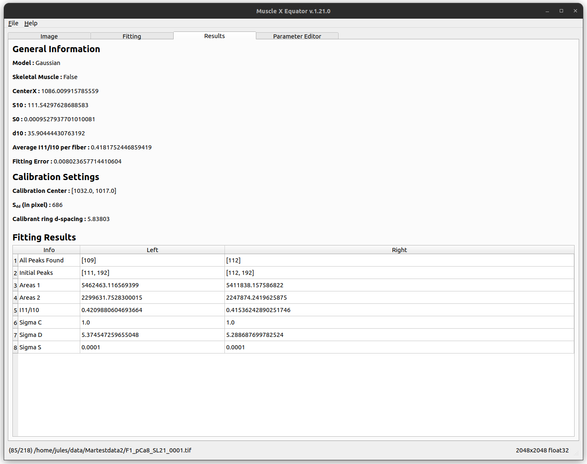

### Parameter Editor
The Parameter editor tab displays all the fit parameters and their corresponding optimum values. As shown in the screenshot below, the columns in the parameter editor are as follows:
* Checkbox indicating whether the parameter was fixed (checked) or allowed to move (unchecked) between minimum and maximum values
* Name of the fitted parameter
* Optimal value of the parameter after fitting
* Minimum value of the parameter used while fitting
* Maximum Value of the parameter used while fitting

The user could further refine the fitting by fixing/unfixing any of the fit parameters, changing the values of the parameter and minimum and maximum value to be used. After making the corresponding changes, "Re-fit Parameters" uses these values as initial guess and refits the model. After refitting, the user can have a look at the results or fitting by switching to the appropriate tab. 

NOTE: The changes made in parameter editor would be temporary and will not be persisted when moved to next image.

Additional features:
* Add 'S' peak parameter - This button is used to add an extra fitting parameter 'S' for each peak. This paramaeter is added to the center of the corresponding peak.
* Enable Extra Gaussian - This button adds three new parameters for the extra gaussian namely, extraGaussCenter, extraGaussSig and extraGaussArea. These parameters would be used to add an extra gaussian to the fitting.

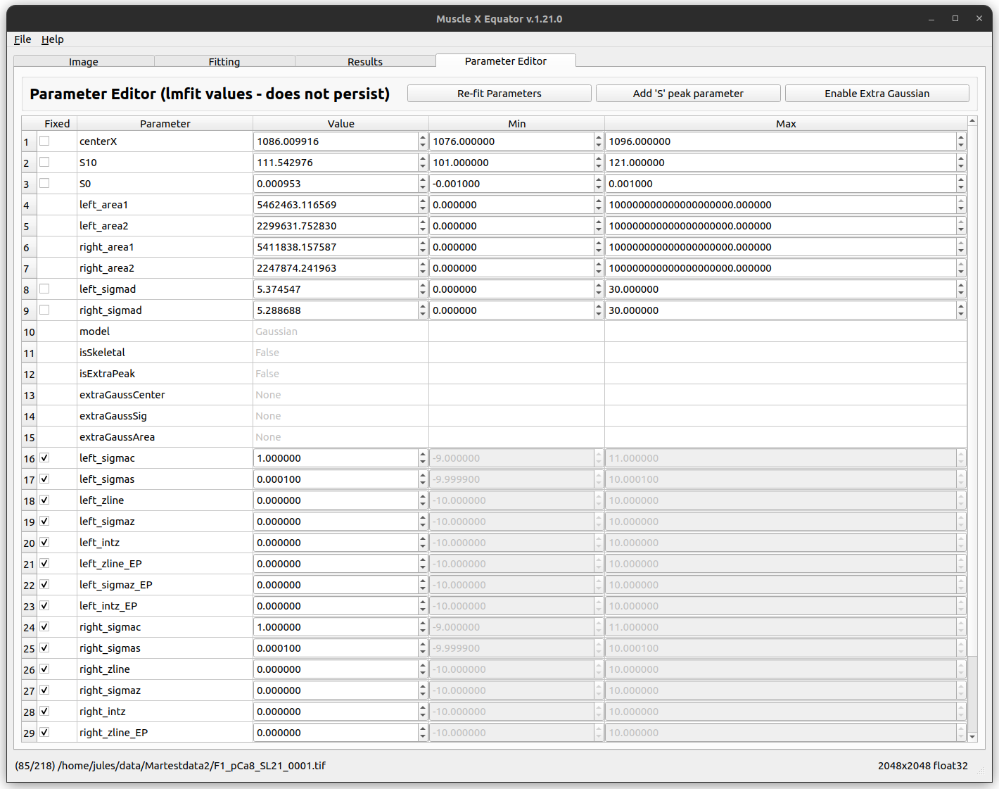

## Headless Mode   
Image processing performed in the terminal.
In the terminal, if the user types `musclex eq|qf|di -h -i|-f <file.tif|testfolder> [-s config.json] [-d]`, MuscleX will run under headless mode.
For example: `musclex eq -h -i test.tif -s config.json`.

Arguments:
* -f \<foldername> or -i \<filename>
* -d (optional) delete existing cache
* -s (optional) \<input setting file>

Note: To generate the settings file, use the interactive musclex, set parameters in it, then select save the current settings in `File` (top left corner). This will create the necessary settings file. If a settings file is not provided, default settings will be used.

### Multiprocessing on folders
In order to improve the processing speed when analyzing time-resolved experiments, the headless mode is processing one image on each processor available on your computer. For example, with a 24-cores computer, 24 images will be processed at the same time, and the results will be saved in the same file. To follow the execution thread of each processor (as the executions intersect), the process number has been added at the beginning of each line.

### Customization of the parameters
Since Headless mode is limited in terms of interactions and parameters to change, you can directly set your parameters in a json format inside `eqsettings.json`. You might need to look at the code and especially 'modules/EquatorImage.py' to know exactly which parameters to set and how to set them.

