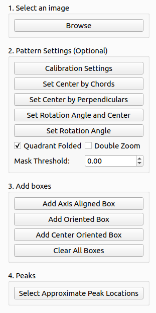
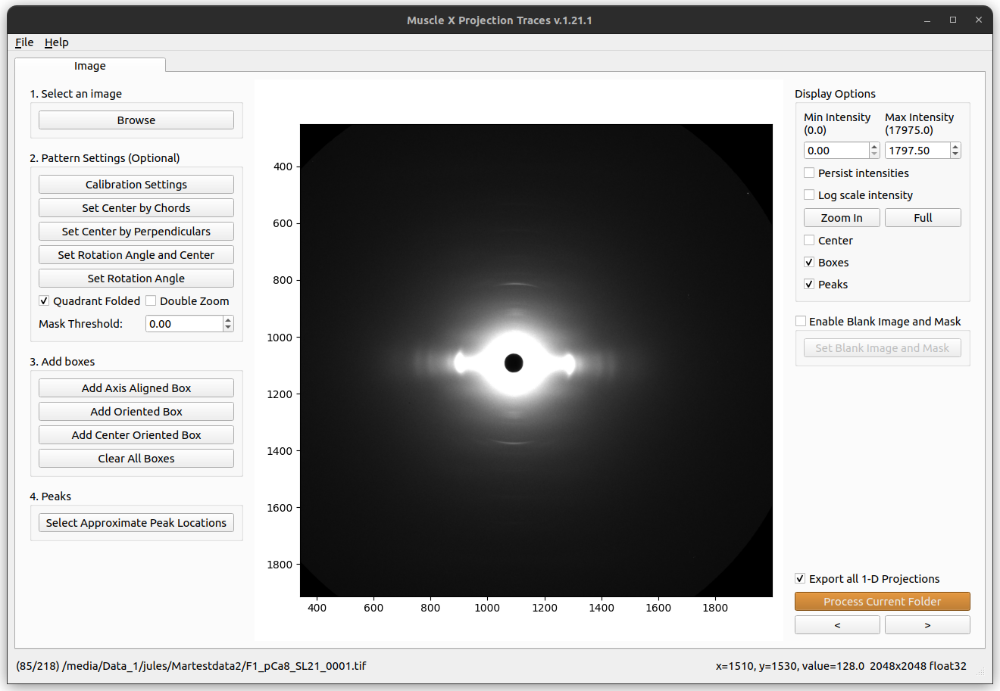
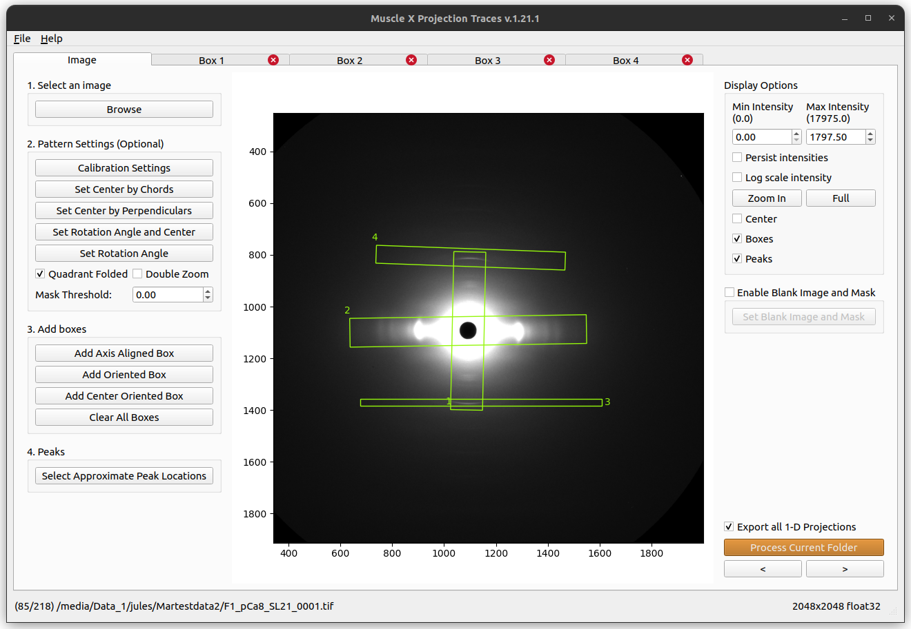
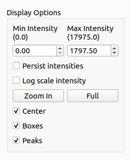
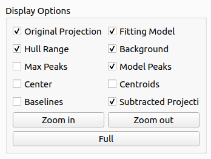

# How to use

Once the program is run, you will see the steps 1 to 4 that you have to do on the left menu bar.

First, select an image to process. Second, configure calibration settings (optional). Third, add how many boxes you want. Finally, select peak locations in each box. For each folder, you just need to do it once on the first image. When another image in the same folder is processed, all these settings will be used.

In this page, you will know about ...
1. [Mask Threshold](#mask-threshold)
2. [Adding and removing boxes](#adding-boxes)
3. [Select Peaks](#select-approximate-peak-locations)
5. [Display Options](#display-options)
6. [Blank Image and Mask](#blank-image-and-mask)
7. [Other Options](#other-options)

## Mask Threshold

The mask threshold allows you to ignore pixels for processing the image. For example if you set-up a threshold of 0, every part of the histogram where the value is less than 0 will be ignored.

## Adding Boxes

There are three options for box selection: axis aligned, oriented, and center oriented boxes.

To add a box, you have to click on one of the box selection buttons, and draw the box on the image. Axis aligned boxes are drawn by selecting a corner and dragging to from a box. The axis of projection can be selected as either horizontal or vertical. Oriented boxes are drawn by select a box center, then the length of the axis of projection, and finally the width of the box. Center oriented boxes are equivalent to oriented boxes, but the pivot is fixed at the center of the image (either the diffraction center, image center (if quadrant folded), or a manually chosen center).

After a box is drawn, a box detail dialog will pop up. You need to specify box's name and background subtraction method along with the axis of projection for axis aligned boxes. This background subtraction will apply to the projection after peaks are selected. The axis of projection is assumed to be along the length of the box.

Once a box is added, there's a new tab created. You can add how many boxes you need by repeatedly adding a box. The box name will be written on the image and its information will be displayed in its tab.

### Remove A Box
To remove a box, you can just close its tab.

## Select Approximate peak locations
To select the approximate peak locations, you can just click on the button, select them in the box and click "Done". When you select a peak, the program will automatically select the corresponding peak on the opposite site.

If there are multiple boxes, it's better to select the peak locations in the box tab.
To select peaks in the box tab, you can go to that box tab and select peaks by pressing "Select Peaks" button, then select them on the 1-D projection on the left and press "Done".

When peaks in a box is selected, the program will process image by these [steps](Projection-Traces--How-it-works.html) to get all results

## Select Convex Hull Range
If you select Convex Hull as background subtraction method for a box, and peaks are selected. The program will automatically select start and end points for Convex Hull. If you want to change this range, you can click "Set Manual Convex Hull Range" and select start and end points on the plot.

## Display options
In the image tab, there are display options shown on the right. These options will not affect any processing. You can check "Boxes", "Center" or "Peaks" to be displayed on the image. You can zoom-in by pressing "Zoom in" and select the zoom in area on the image by drawing a rectangle. (You can zoom-in or zoom-out by mouse wheeling too). Also, you can select min/max intensity to see the image clearly.

As of version 1.14.11, you can specify a rotation angle and center manually. This is done by specifying two reflection peaks in the diffraction. The image will be rotated according to the new angle.

The `Quadrant Folded?` option determines whether the center is assumed to be the half width and height of the image if it's been quadrant folded. If this box is unchecked, the center will be determined automatically. All peaks will be reflected over this center in any drawn boxes. Use the `Center` checkbox to see which center is used by Projection Traces.

In each box tab, you will see multiple check boxes in the section. You can check or uncheck whether you want to see it in the plot

### Calibration options

#### Set Rotation and Center
Before setting manual rotation and center, it’s better to zoom the image to the area of the diffraction because it will be easier to set these parameters correctly. To set the rotation and center, you need to click 2 positions of the image. The first one will be a reflection peak on one side of the equator, and the second one will be the corresponding (opposite) reflection peak on the other side of the equator. To cancel, press ESC. 

#### Double Zoom
This feature is used to zoom into subpixel level accuracy. On checking this box, a new subplot is created on the top right of the image. As you move the mouse pointer into the image area, 20 x 20 pixels centered at the location of the mouse pointer is cropped from the image and scaled up to 10 times and plotted in the subplot mentioned earlier. This feature can be used with any calibration feature (Set Rotation, Set Center and Rotation...). Click the double zoom check box so that the subplot appears. Click on a calibration button, for example the Set Center and Rotation button. Drag your mouse pointer to the position you want to select the first point (or the first reflection peak as described earlier). Click the image to freeze the subplot region. A message appears, check do not show again box to not see this message again. Click on the exact point in the subplot region, which plots an equivalent point in the main image. Perform the previous two steps to select the second point. Uncheck the Double Zoom checkbox to hide the subplot window. 

## Blank Image and Mask

See the [Blank Image and Mask](Blank-Image-and-Mask.md) documentation for more information on how to use this option.

## Other Options
There're several options on the bottom left in image tab.

* Export All 1-D Projections 
If this checkbox is checked, and boxes are added, the program will save the original 1-D projection to a text file in 1d_projections folder under pt_results which is created under the image directory. If peaks are also specified, background subtracted projection will be saved in the same folder too.
* Process Current Folder 
This will process the whole images in current directory with current settings (boxes and peaks)
* Previous and Next Buttons 
This will make the program go to process the next or previous image with current settings
