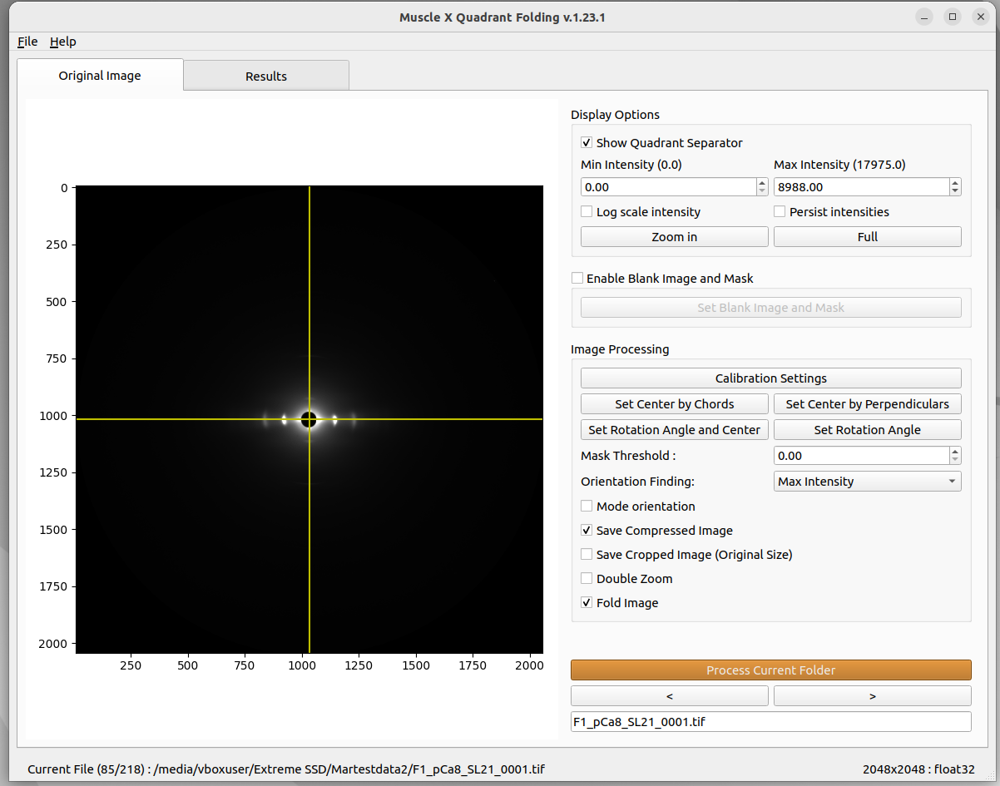

# Introduction

The equator and the meridian of a fiber diffraction pattern divides a pattern into four quadrants. Because of Friedel’s Law each of the 4 quadrants will contain the same information.  If you add the four quadrants together you effectively have 4 times the signal improving the signal to noise by factor of 2 (square root of 4).  You can regenerate a full diffraction pattern by simply rotating the summed quadrant. 

It usually better to analyze this “quadrant folded” image than the original image because of the improved signal to noise will make the data easier to fit as well as allow better estimates of the backgrounds. Quadrant Folding is a program for generating such a quadrant-folded image. Other advantages of quadrant folding is that it can compensate for detector imperfections by substituting data from the unaffected quadrants for the affected area.  This is particularly useful for data collected using Pilatus detectors which have substantial gaps between the detector elements. 

The program also can estimate and remove the diffuse background scattering from an image using a number of different algorithms, alone or in combination. It includes all the background subtraction routines from the CCP13 suite (https://github.com/scattering-central/CCP13) plus one based on a two dimensional convex hull and another on white top hat filtering. It is possible to merge different background estimates to apply one algorithm at low scattering angles and a different one at high scattering angles.

Once set up, the program can process an entire directory of images without user intervention.

### More Details
* [How it works](Quadrant-Folding--How-it-works.html)
* [How to use](Quadrant-Folding--How-to-use.html)
