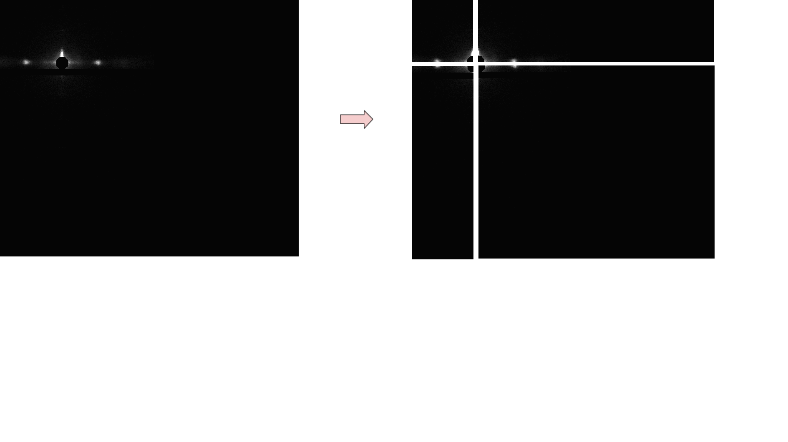
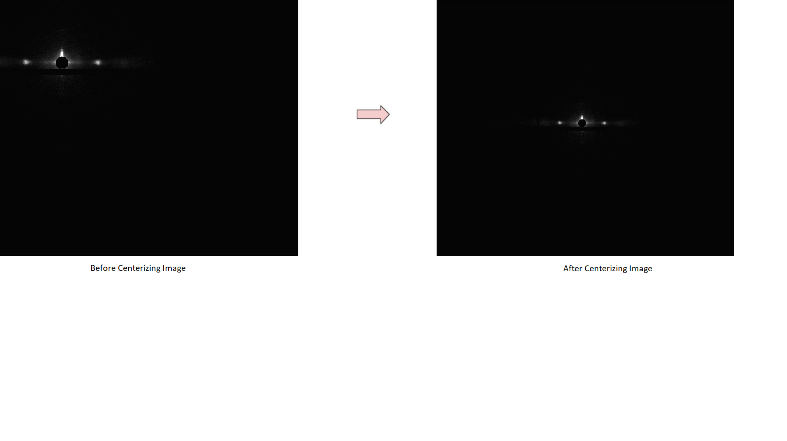
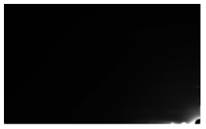
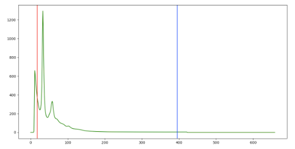
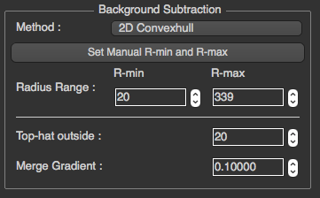
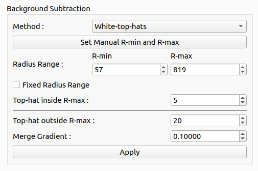
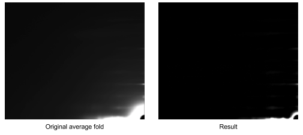
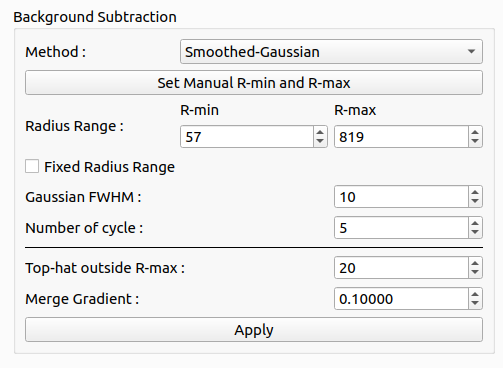
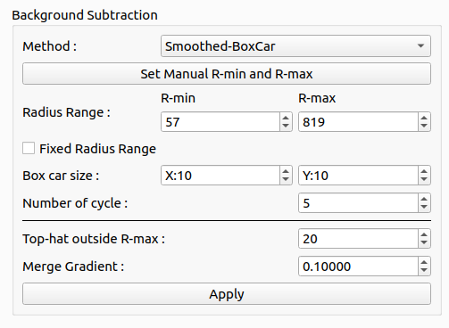
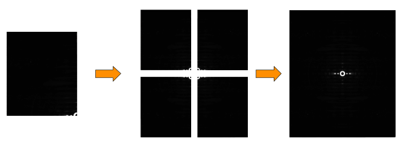

# How it works

When an image is selected, the program will immediately process the image automatically. The resulting image will be saved as [image_name].result.tif in the qf_results folder that is created as a subdirectory of the folder containing the selected file. The program will process an image by going through a series of processes in the order described below

## Processes
### 1. [Find Center](../Image-Processing-Functions.html#finding-center)
### 2. [Calculate Rotation Angle](../Image-Processing-Functions.html#calculate-rotation-angle)
### 3. Centerize image (Image size increases) only if "Expand the Image" is Checked
The diffraction center need not always occur at the center of the image. Therefore, when we fold about the diffraction center, the four quadrants generated may not be of equal size which results in the quadrant folded image being cropped. The image below illustrates the same.

Hence, we enlarge the image such that the diffraction center lies at the center of the image. This results in all four quadrants having the same dimension and hence the folded image is not cropped.

  
### 4. Calculate Average Quadrant
To find the average fold, the image will be split into 4 quadrants, and each quadrant is flipped to be in the same orientation as below.

After all quadrants are flipped, a new image will be generated by averaging each pixel from all quadrants. The mask threshold will be used to determine if that pixel will be included in averaging process. In this case, the mask threshold is 0. That means if the pixel intensity is less than 0, the program will ignore that pixel.  Finally, the result image will look like the image on the right. The full 2D pattern can then be regenerated by rotations of this image. 

### 5. Calculate R-min and R-max
For the background subtraction algorithms to work, it is necessary to define a [minimum radius R-min](../Image-Processing-Functions.html#calculate-r-min) and a maximum radius R-max to define the region that is assumed to contain real data. To find R-max, the radial histogram will first be re-computed  from the average folded image. R-max (blue line) is initially chosen to be  simply 60% of the diagonal of the image. These two values are intended as  just approximate starting points, that users can change manually.

### 6. Apply Background Subtraction
Fiber diffraction patterns from muscle have a substantial diffuse background arising from non-crystalline parts of the muscle that do not diffract coherently including membranes and mitochondria as well as diffuse scattering from the myosin heads. Intact cardiac muscle, in particular has a very strong background. This background pattern has a complex structure making it hard to model and effectively remove.  Various algorithms exist that attempt to remove the background. No one technique so far can effectively remove background in all parts of the image without over subtraction in some parts of the pattern but some techniques work better than others depending on the muscle and specific preparation. Quadrant folding implements several different algorithms  that can be used individually or in combination that can be used to background subtracted images for display or subsequent analysis.

Generally speaking, the “White Top-Hat” algorithm works well at large radii from the center and some other algorithm will work better than others, depending on the type of muscle generating the X-ray pattern,  at low radii. Two images will be produced from this process. The first image will be created using one of several  background subtraction approaches, and the second image will be created using the White-top-hat approach. These 2 images will be merged as described below. At present, there are 4 options for background subtraction in the first (low radius) image, Circularly symmetric, 2D Convex hull, and White-top-hat.

<!---
#### 5.1 Angular Background Subtraction
[[/images/QF/angular.png]]

The necessary parameters for this scheme for background subtraction are the pixel range in percentages, and the angular bin size for integration in degrees. In this method, the program will:

1. Obtain the 2D azimuthal integration from the average folded image. The x-axis represents radius, and y-axis represents angle. In this case, we need to do this integration for only one quadrant, so the angle range is from 0 to 90 °. 

2. obtain the estimated background line for each bin. For example, if the degree bin size is 30. There will be 3 background estimates lines for each of the degree ranges 0-30, 30-60, and 60-90. Each background estimate line is produced by going to  each radial position in the angular  bin range, sort all pixels at that radius by intensities, and the background value is chosen as the mean value of intensities between specified pixel ranges from the minimum value to the maximum value. The background  value for each radius is used to generate a 1d background estimate for the chosen angular bin range. Each line will have a 1d convex hull applied to define a surface and the pchip algorithm is used to interpolate between points in the convex hull in order to generate a smooth curve.

3. a two D background image is formed from the individual lines by assuming the same profile throughout the angular bin range that generated it. This 2D image can then be subtracted from the original image to generate a background-subtracted image

[[/images/QF/angular_img.png]]
-->

#### 6.1 Circularly symmetric Background Subtraction

The necessary parameters for this scheme for background subtraction are the pixel range in percentages, the radius bin size in pixels, smooth parameter for spline. In this method, the program will
1. Go to each radius bin, sort all pixel in the bin, and calculate background value by averaging intensity of pixels in specified pixel range
2. After the a background value is determined for each radius bin,  these values are combined by fitting a spline curve with specified smooth and tension parameters
3. A 2D background is generated by spreading the spline curve through 360 degrees. This 2D image can then be subtracted from the original image to generate a background-subtracted image

This method is from [CCP13 FibreFix](http://www.diamond.ac.uk/Beamlines/Soft-Condensed-Matter/small-angle/SAXS-Software/CCP13/FibreFix/FibreFix.html) and their fortran codes are available on [GitHub](https://github.com/scattering-central/CCP13)

#### 6.2 2D Convex hull Background Subtraction (Deprecated since MuscleX 1.21.1)

The necessary parameters for this kind of background subtraction are again R-max and R-min. Initial values for these parameters are provided by the program. Users can change these parameters if necessary.
The convex hull identifies the closest surface that contains all the points along the smoothly decaying background.  A 1D convex hull can be generated using the “shrink wrap” algorithm that follows the surface generating a series of of lowest points along the surface.  The 2D convex hull surface is created by generating a 1D convex hull background subtraction to the radially integrated intensity over a 0.5 angle bin for each bin in the 90 degree summed quadrant using R-min and R-max as start and end points for calculating the 1D convex hull. Prior to calculating the convex hull, this intensity trace is smoothed to reduce the effect of noise. To create a background image, the pchip algorithm is used to interpolate between points in each 1D convex hulls. The pchip algorithm will be used again to interpolate a surface joining the points on the 1D convex hulls to create a 3D background image. Then, the program will subtract the background image from the original image.

#### 6.3 Roving Window Background Subtraction

The necessary parameters for this kind of background subtraction are R-max, R-max, window size, window separation, pixel range, smooth and tension factors. The roving window background subtraction method of Paul Langan estimates the background by moving a window (of size input by the user) across the collected data. The pixel values within this window are sorted and those in the user-selected range are taken as background (except pixel values lying outside the pattern extents or specified by the user as values to discard). The average pixel value within this range is then assigned to be the estimated background at the centre of the window. Fiinally, a smoothing spline under tension is fitted to fill in the gaps between window centres. (From [FibreFix Document](http://www.diamond.ac.uk/Beamlines/Soft-Condensed-Matter/small-angle/SAXS-Software/CCP13/FibreFix/FibreFix.html))

#### 6.4 White-top-hat Background Subtraction

The white top-hat transform is an operation that extracts small elements and details from given images. The white top-hat transform of f is given by Tw(f)= f – f°b where ° denotes the morphological [opening operation](https://en.wikipedia.org/wiki/Opening_%28morphology%29) by a structural element b which we will call a kernel. This will retain features that are "smaller" than the structuring element (i.e., places where the structuring element does not fit in), and are brighter than their surroundings. So it is somewhat similar to the “rolling ball” background subtraction algorithm in ImageJ but more general. The only parameter that needs to be specified for this kind of background subtraction is the size of the applied kernel. The kernel will be created by using the [disk](http://scikit-image.org/docs/dev/api/skimage.morphology.html#skimage.morphology.disk) function from scikit-image, and applied to original image by using the [white_tophat](http://scikit-image.org/docs/dev/api/skimage.morphology.html#skimage.morphology.white_tophat) function.

#### 6.5 Smoothed Background Subtraction
The necessary parameters are R-min, R-max, number of cycles, and filter type. This method of background subtraction is based on that of M.I. Ivanova and L. Makowski (Acta Cryst. (1998) A54, 626-631). For more information please see [CCP13 FibreFix](http://www.diamond.ac.uk/Beamlines/Soft-Condensed-Matter/small-angle/SAXS-Software/CCP13/FibreFix/FibreFix.html)
##### 6.5.1 Gaussian

This filter requires FWHM parameter
##### 6.5.2 Boxcar

This filter requires Box car size parameter

### 7. Merge Images
If two background images are generated, one at high radius from the center, one at low, they are merged together by defining a “merge gradient”.  The merge radius (R-max) is the position at which the two background images are merged together while the “merge gradient” is a smoothness parameter to make the transition between the two images smooth. 

Merge gradient is a parameter k for [[/images/QF/gradient.png]] while r is merge radius. Therefore, if the merge border will be smoother when k < 1. If k > 1, the merge border will be more pronounced.

### 8. Generate Result Image
To generate a result image, the program will just copy the background subtracted average folded image and flip them to correct their orientation for all 4 quadrants, and then combine them together.

