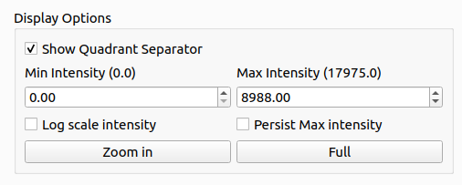
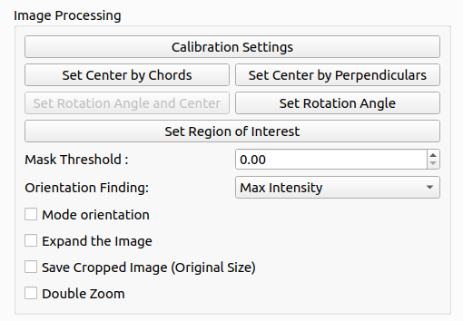
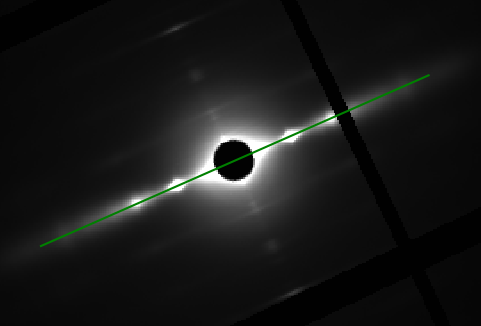
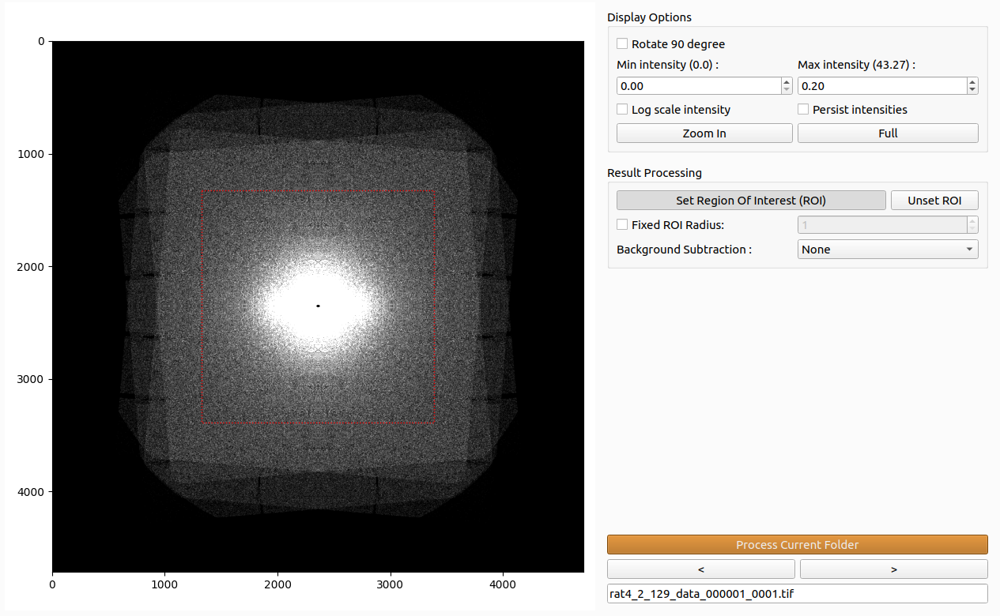
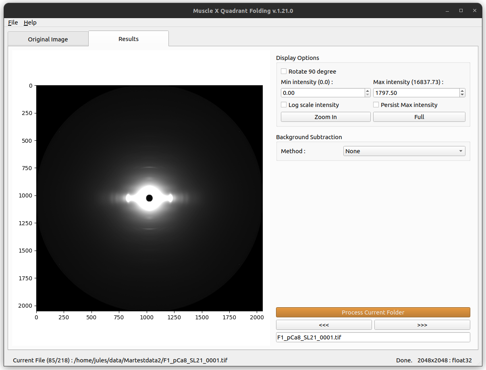
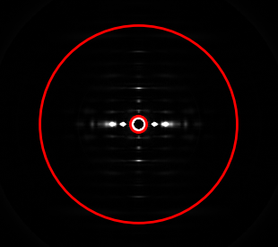
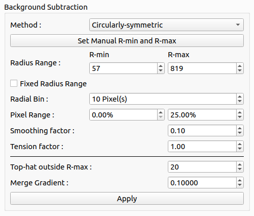
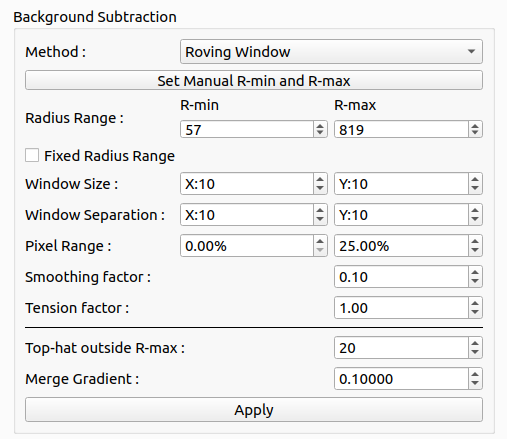

# How to use

Quadrant Folder (QF) provides two modes for users: Interactive mode and Headless mode  

## Interactive Mode 

After the program is opened, users will be able to select a file or a folder to process by pressing the button or select an option on the menu bar. 

### Original Image
In this tab, the original image will be shown along with various options displayed on the right, Display Options, Image Processing, and Fix Center.

If it is the first time processing the images, the Next image button will process the following image using the current parameters (in the Image tab AND the Results tab). If you already processed the images, the program will use the cached files to load faster and avoid reprocessing. The display will adapt to each image depending on the cache if you click on Next or Previous image. If you want to reprocess all the images with the current settings, you can click on 'Process Current Folder', or delete the file named 'qf_cache' before launching Quadrant Folder.

#### Display Options

All options in Display Options will not affect any processing. These options allow users to see more detail in the image by setting minimal intensity, maximum intensity, and zooming. You can also choose whether or not to see the meridional and equatorial axes. To zoom in, the user needs to simply press the Zoom in button, and select the zoom region by drawing a rectangle as shown below. Once 'Zoom in' or 'Full' button is clicked, the current zoom level is persisted when moved to the next image. The check box 'Persist intensities' is used to persist the max and the min intensities when we move to the next image.

#### Blank Image and Mask
See the [Blank Image and Mask](Blank-Image-and-Mask.html) documentation for more information on how to use this option.

#### Image Processing

##### Mode Orientation Checkbox
This checkox uses the mode of the orientation angles in calculated from all the images in the folder as the rotation angle for fitting the images. All the images in the folder must be processed first before using this checkbox.

##### Save Cropped Image Checkbox
As discussed in the working of Quadrant Folding, we enlarge the image such that the diffraction center is at the center of the resulting image.
On selecting this option the resulting quadrant folded image (which is saved in qf_results) is cropped such that the size of the image is same as the original input image size.

##### Set Rotation and Center
Before setting manual rotation and center, it’s better to zoom the image to the area of the diffraction because it will be easier to set these parameters correctly. To set the rotation and center, you need to click 2 positions of the image. The first one will be a reflection peak on one side of the equator, and the second one will be the corresponding (opposite) reflection peak on the other side of the equator. To cancel, press ESC. 

##### Set Center By Chords
Before setting center by chords, it’s better to zoom the image to the area of the diffraction because it will be easier to set these parameters correctly. This method is used to find the diffraction center and uses the fact that "All perpendiculars to the chords in a circle intersect at the center". On clicking this button, you will be prompted to select points along the circumference of the diffraction patter. As you select these points, perpendicular lines to the chords formed using these points start to appear on the image in blue color.  Once you finish selecting the points, click the same button again to start processing. The diffraction center will then be calculated by taking the average of the intersection points of the perpendicular lines (blue lines in the figure). 

##### Set Center By Perpendiculars
Before setting center by perpendiculars, it’s better to zoom the image to the area of the diffraction because it will be easier to set these parameters correctly. This method finds the center of diffraction using intersection of perpendicular lines. On clicking this button, you are prompted to select multiple positions in the image. You can start by clicking the first reflection peak on one side of the equator and the second will be the corresponding (opposite) reflection peak on the other side of the equator. This forms one horizontal line. You can continue drawing as many horizontal lines using this process of selecting reflection peaks. Next, you can click the reflection peak vertically above the equator and the following point symmetrically below the equator. Again, you can draw multiple such lines. Once you finish selecting the points, click the same button (Set Center By Perpendiculars) again to start processing. The diffraction center will then be calculated by taking the average of the intersection points obtained by the horizontal and vertical lines plotted. 

##### Set Rotation Angle
This assumes that the center of diffraction is correct. After the button is clicked, the program will allow users to select an angle by moving a line. Clicking on image when the line is on the equator of the diffraction will set manual rotation angle. To cancel, press ESC. 

The Mask Threshold is used for excluding certain pixel values when calculating the folded image. The program will ignore pixels with intensity below mask threshold. This can be used to remove the dark gaps in images resulting from the gaps between detector elements in Pilatus detectors, as well as other detector abnormalities.

To fix the center position to a user supplied value, you can check Fix Center check box, specify the coordinates of the beam center (before rotation). The image will be reprocessed when x, or y is changed. This will affect the next image if it’s still checked.

##### Double Zoom
This feature is used to zoom into subpixel level accuracy. On checking this box, a new subplot is created on the top right of the image. As you move the mouse pointer into the image area, 20 x 20 pixels centered at the location of the mouse pointer is cropped from the image and scaled up to 10 times and plotted in the subplot mentioned earlier. This feature can be used with any calibration feature (Set Rotation, Set Center and Rotation...). Click the double zoom check box so that the subplot appears. Click on a calibration button, for example the Set Center and Rotation button. Drag your mouse pointer to the position you want to select the first point (or the first reflection peak as described earlier). Click the image to freeze the subplot region. A message appears, check do not show again box to not see this message again. Click on the exact point in the subplot region, which plots an equivalent point in the main image. Perform the previous two steps to select the second point. Uncheck the Double Zoom checkbox to hide the subplot window. 

##### Set Region of Interest
This feature is used to select part of the image and perform Quadrant folding on that part. For example, we would want to ignore the artefacts on the edges of the image. On clicking this button, a default rectangle appears around the center of diffraction. As you move the mouse pointer into the image area, the vertical edges of the rectangle move to where the mouse pointer is located in a symmetrical fashion. Click on the image to accept the current width of the region. Next, as you move the pointer, the horizontal edges of the rectangle start moving to where the mouse pointer is located in a symmetrical fashion. Click on the image to accept the current height of the fitting region. Once the width and height is fixed, the resultant image will be cropped to the region selected by the rectangle following which we process quadrant folding on the resultant image. Therefore, any artefacts present outside the selected region are ignored while quadrant folding. One can only select the region of interest about the center of diffraction.

### Results
In this tab, the resulting image will be displayed along with options on the right. Display Options will provide the same options as in Original Image tab. Users can specify min and max display intensity, and zooming.

If it is the first time processing the images, the Next image button will process the following image using the current parameters (in the Image tab AND the Results tab). If you already processed the images, the program will use the cached files to load faster and avoid reprocessing. The display will adapt to each image depending on the cache if you click on Next or Previous image. If you want to reprocess all the images with the current settings, you can click on 'Process Current Folder', or delete the file named 'qf_cache' before launching Quadrant Folder.

For the background subtraction section, by default, the program will not apply any background subtraction. To apply background subtraction, you can choose a method by method drop-down list. There are currently 6 options, [Circularly Symmetric](#circularly-symmetric), [2D Convex hull](#2d-convex-hull), [Roving Window](#roving-window), [White-top-hat](#white-top-hat), [Smoothed-Gaussian](#smoothed-gaussian), and [Smoothed-Boxcar](#smoothed-boxcar)

For each method, users can select R-min and R-max manually by pressing the button and select R-min and R-max in the image as shown below

#### Circularly Symmetric

#### 2D convex hull

#### Roving Window

#### White top hat

#### Smoothed Gaussian

#### Smoothed Boxcar

You can change the parameters and click Apply to make the program re-process the background subtraction

#### Merging
For the merging settings, they will be under the white line in the Background Subtraction section. There is the ability to set also another top hat parameter for regions of the image outside the R-max so the top hat parameter can be different inside and outside the merge radius if desired. 

To set the merge gradient, simply change the value in the Merge Gradient spinbox

## Headless Mode  
Image processing performed in the terminal.
In the terminal, if the user types `musclex eq|qf|di -h -i|-f <file.tif|testfolder> [-s config.json] [-d]`, MuscleX will run under headless mode.
For example: `musclex qf -h -i test.tif -s config.json`.

Arguments:
* -f \<foldername> or -i \<filename>
* -d (optional) delete existing cache
* -s (optional) \<input setting file>

Note: To generate the settings file, use the interactive musclex, set parameters in it, then select save the current settings in `File` (top left corner). This will create the necessary settings file. If a settings file is not provided, default settings will be used.

### Multiprocessing on folders
In order to improve the processing speed when analyzing time-resolved experiments, the headless mode is processing one image on each processor available on your computer. For example, with a 24-cores computer, 24 images will be processed at the same time, and the results will be saved in the same file. To follow the execution thread of each processor (as the executions intersect), the process number has been added at the beginning of each line.

### Customization of the parameters
Since Headless mode is limited in terms of interactions and parameters to change, you can directly set your parameters in a json format inside `qfsettings.json`. You might need to look at the code and especially 'modules/QuadrantFolder.py' to know exactly which parameters to set and how to set them. For example, to set the background subtraction, you need to set 'bgsub' to one of the following string: 'None','2D Convexhull', 'Circularly-symmetric', 'White-top-hats', 'Roving Window', 'Smoothed-Gaussian' or 'Smoothed-BoxCar'.

