# How it works

There are 2 modes for Scanning Diffraction
1. [Individual Image Mode](#individual-image-mode)
2. [Folder Mode / Batch Mode](#folder-mode)

## Individual Image Mode
When an image is selected, if there is an image in the same folder named “calibration.tif”, the [calibration settings](../Calibration-Settings.html) the calibration settings window will pop up. If there’s no calibration image or it’s set already, the image will be processed automatically. However, if the image has ever been processed with the same version of the program, the cache will be downloaded, so the image won’t be processed again. Using a  calibration image or inputting the calibration information directly allows conversion of distance in pixels to d-spacings in nm. If calibration information is not provided, distances to diffraction rings are left in numbers of pixels.

To process an image, the program will go through multiple processes in the order:
#### 1. [Find Center](../Image-Processing-Functions.html#finding-center)
#### 2. Obtain 2D integrated intensities  and 1D Radial Integration
In this process, the program will obtain 2D and 1D radial integrated intensities  of the entire diffraction image  using the previously determined center. The program will use functions from the [pyFAI](http://pyfai.readthedocs.io/en/latest/) library to produce the integrated intensity using FPGA hardware acceleration if available.  The 2D integrated intensity will be used for [Finding Rings by Log Central Differences Method](#4-find-rings-by-log-central-differences-method) and 1D integrated intensity (after Convex Hull background subtraction is applied) will be used for [Finding Rings by Partial Integration Method](#3-find-rings-by-partial-integration-method) and [Fitting Model](#6-fit-gaussian-models-to-1d-radial-integration). 
For example, if the image is 
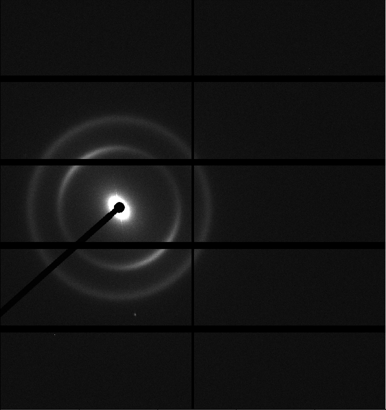 
The 2D radial integrated intensity map is .. 
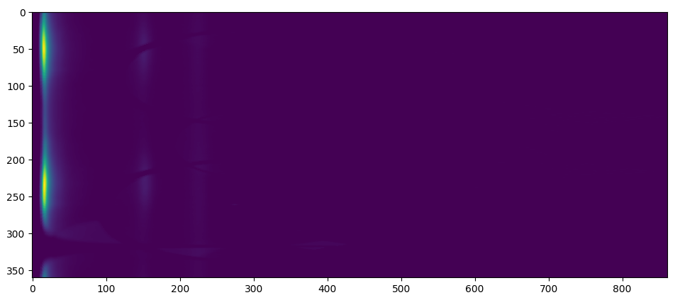 
and the 1D radial integrated map is .. 
 

#### 3. Find Rings by Partial Integration Method
In order to find the ring locations, 2 methods are used, Partial Integration, and [Central Difference](#3-find-rings-by-partial-integration-method). In this process, [pyFAI](http://pyfai.readthedocs.io/en/latest/) will be used to find the 1D integrated intensity a pie-shaped region around the center.   This angular range of this pie-shaped region can be specified by user with a  default of 90 degrees. Here are shown multiple 1D integrated intensity traces, one from each range, when the angle size is 90.

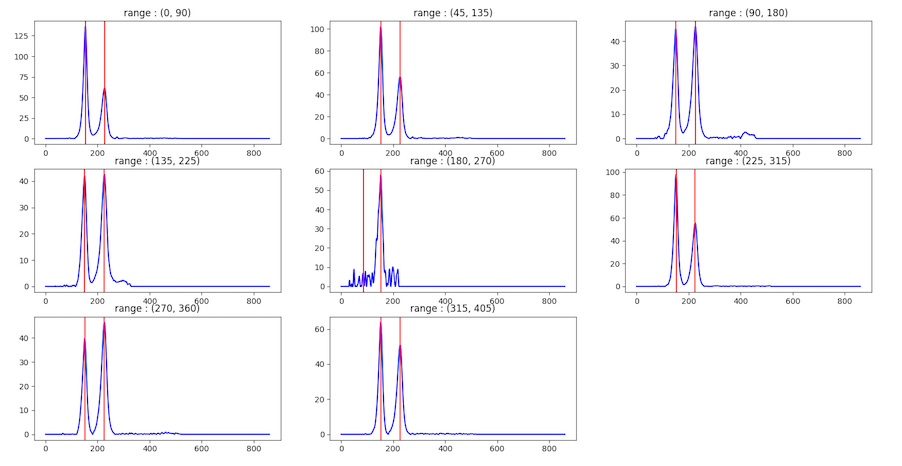

For each range, the program will try to find peak locations in the integrated intensity trace. The program will consider a peak as representing a ring when a peak appears at least one quarter of the number of angular ranges. For example, if there are 8 ranges and a peak appears in 2 ranges, this peak is considered a ring. However, if a peak does not appear in many ranges, but its area is large, it's may also be considered as a ring.

#### 4. Find Rings by Log Central Differences Method
This can be useful at locating weak peaks in the presence of strong ones in a pattern. In this process, the program will try to find rings by finding "runs". First, 2D integration produces a 2D plot of pixel intensity as a function of angle and radius. Two additional images are generated by shifting the radius axis first left and then right by q0 pixels and te three images summed.  The result is shown on a logarithmic scale  After that, the program will go to each column and find "run:s. Runs are defined as columns of pixels containing values higher than the median in the image, and those pixels have similar value. Then, the rings will be considered from grouping runs. For example,

* 2D integration 
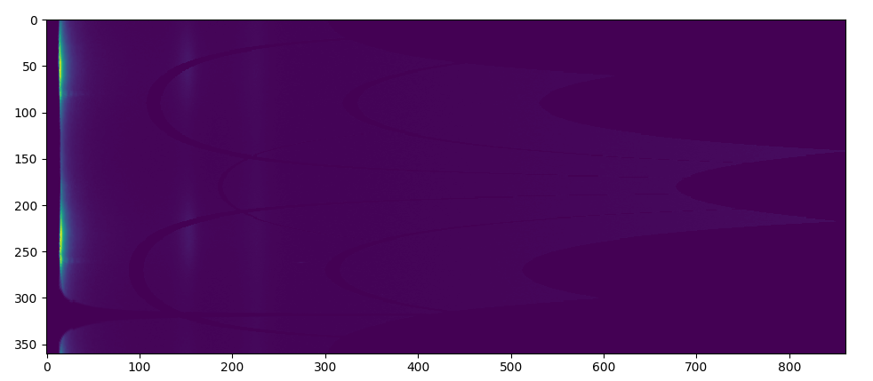

* After applying log central differences 
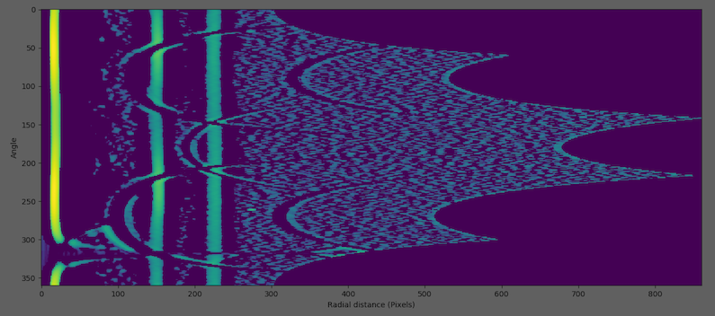

* Finding runs (red lines) 

* Grouping runs to rings (white lines) 
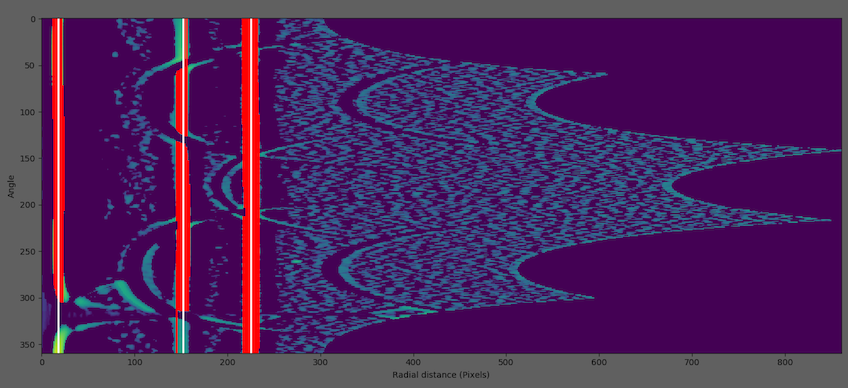

#### 5. Merge Rings
After the ring locations are calculated by 2 methods above, those rings will be merged in this process. Rings with similar distances will be averaged. For example, if the first method found rings at 50, 80, 118 pixels and the second method found rings at 82, 120, 180 pixels. The final rings will be at 50, 81, 119, 180 pixels.

#### 6. Fit Gaussian Models to the 1D Radial Integrated intensity
In this process, multiple Gaussians will be fit to the 1D radially integrated intensity trace by using the ring locations as the initial centers for the Gaussians.

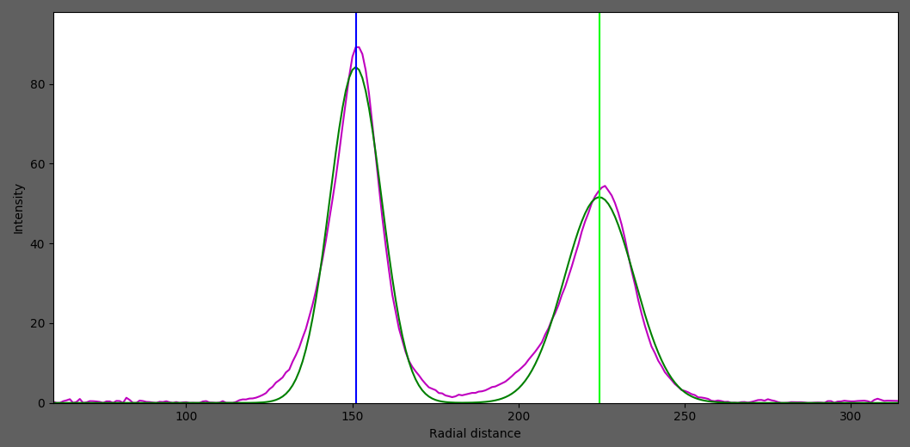

After fitting, we will get ..
* Distance from center to the ring
* Standard deviation of the ring distribution in radial direction
* Integrated area of the ring

#### 7. Finding Other Properties of Each Ring
In this process, the program will go to each ring and obtain the angular projection of the ring. In the example above, these are 2 angular projections where the x-axis is the angle in radians and the y-axis is integrated intensity. 
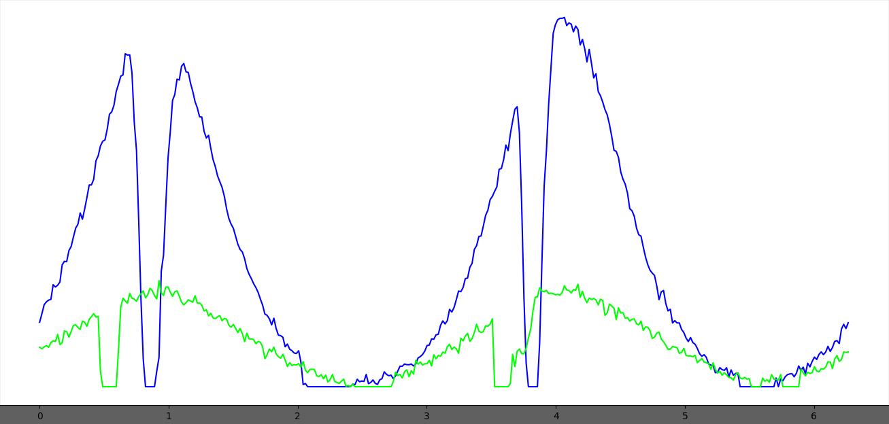

Then, 2 Gaussians will be fit to the projection to find the angle, and the angular range. The distance between the 2 Gaussian centers is assumed to be Pi radians.

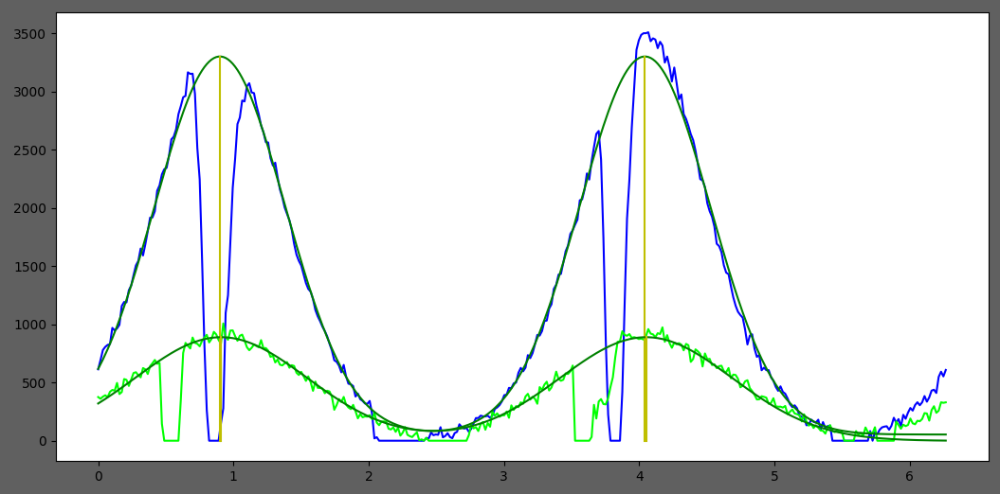

Finally, we will get ... 
* Orientation angle of the ring 
* Standard deviation of the orientation angle (Angle sigma)
* Integrated area of the ring

After everything is processed, results will be written to summary.csv and a different rings.csv  file. These files will be located in the folder cp results which is created under the folder containing the images. Currently, the file summary.csv contains the name of the image, the total diffracted intensity, and number of rings detected. In the rings.csv file, all information for all rings will be provided along with their fitting error. Note that there is no attempt made to index families of rings. Each ring is associated with its own unique d-spacing. The assumption is that the results data files will be processed by user supplied code to index the patterns.

Another file BackgroundSummary.csv is written to cp results folder after processing. This file contains the Average pixel value and the Number of pixels outside the mask (or outside rmin if a mask is not specified) for each image processed. The calculation ignores any grid lines if present.

## Folder Mode

When a folder is selected, the program will get all image names in the folder, and check if all images have been processed by checking the summary.csv and rings.csv files. If there are some images which have not been processed, the program will process all those images using the [individual mode](#individual-image-mode) first, and then generate maps from summary.csv and rings.csv.

In this mode, you will see 4 maps, Total Intensity Maps, Angular Range Maps, Orientation and Intensity Vector Field, and Elliptical Representation. Each pixel in the maps represents an individual diffraction image from the original image folder. To generate the maps, the program can use the  hdf data file generated by the BioCAT scanning diffraction imaging  script if it was used to  produce the image files. If there is no hdf file, one can be generated by providing start point in the X-direction and the X-pixel size and the start point in the Y direction and the Y-pixel size.

#### 1. Total Intensity Maps
Total intensity from summary.csv 
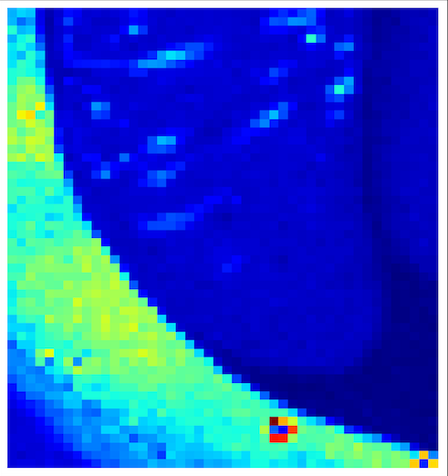

#### 2. Angular Range Maps
Value of Standard deviation of the orientation angle (Angle sigma) of [the best ring](#the-best-ring) from rings.csv 
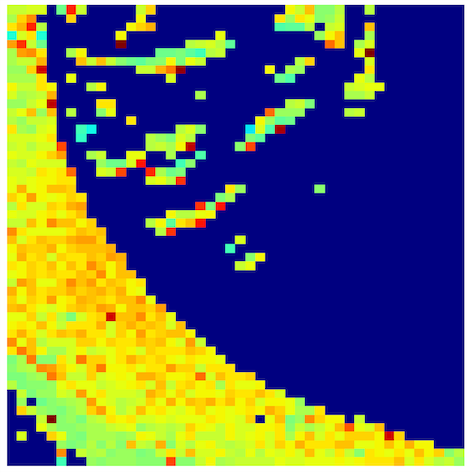

#### 3. Orientation and Intensity Vector
Angle of [the best ring](#the-best-ring) from rings.csv as vector direction, and total intensity from summary.csv as color 

#### 4. Elliptical Representation
Angle of [the best ring](#the-best-ring) from rings.csv as ellipse orientation, total intensity from summary.csv as color, and angle sigma as ellipse size 

***

##### The best ring 
These are the  ring parameters which provides the lowest fitting error. The  fitting error and angle sigma must be less than 1 in order for isotropic rings to be omitted from the angular distribution maps.
