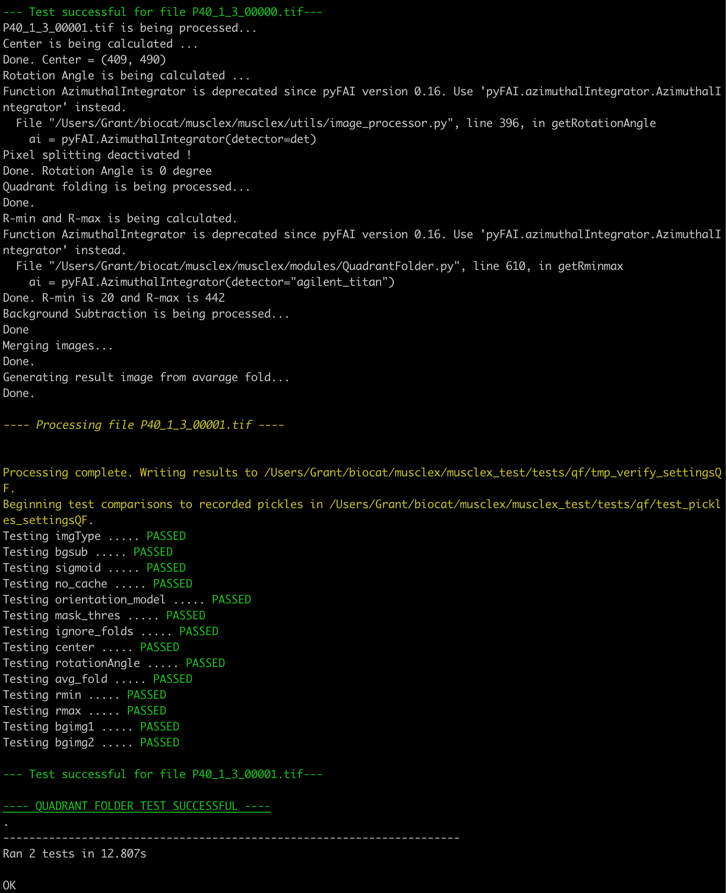

# Tests Overview

## Testing Methodology

The testing suite in `musclex_test/tests/` is used for verifying that MuscleX produces predictable results across version changes.  Each module is tested independently using `module_test.py`. The module test runs in two modes - `testrecord` and `testverify`. In `testrecord`, module output is serialized to `Pickle` files for a particular set of input test data. In `testverify`, the same data is processed again and serialized to `Pickle` files, but is then compared to the files produced in `testrecord` mode. If any of these comparisons fail, it's deemed a failing test and the location of the failure is returned to the user.

This approach provides a couple of important assurances. For developers, it ensures that no unexpected changes in module behavior come up that are caused by changes across versions. For installers, this verifies that an installation is behaving in the way developers expected. The testing framework also provides a tool for ensuring the reproducibility of results across devices.

### `testrecord`

When a new version is pushed that causes changes in test output, a new set of test data should be recorded. To do this starting from the root of the repository:

1.  Change directory to the test directory.
```
cd musclex_test/tests/
```
2. Run `module_test.py` in `testrecord` mode.
```
python module_test.py testrecord
```

As of 3/5/19, this will record test objects for EquatorImage in two different settings mode and for QuadrantFolder.

Serialized `Pickle` files will be written to `<modulename>/test_pickles`. One file is written for each field in a module object's `info` class variable.


An example of `testrecord` output.

### `testverify`

Once output data has been recorded using `testrecord`, tests can be run using `testverify`. `testverify` mode processes the same input data as `testrecord`, and compares the output against the data in `<module_name>/test_pickles`.

To run the whole testing suite use the following command from the root of the repository:
```
python -m unittest discover -s musclex_test
```

A successful test should produce output similar to the following:


## Testing Data

Test data used is found in `/musclex_test/tests/test_images`. Each time data in this directory is changed, `testrecord` should be rerun.

Given a module and corresponding settings, test `Pickle` files are written to folders in `<module_name>/test_pickles_<settings_name>`. In `testverify` mode, a directory `<module_name>/tmp_verify_<settings_name>` is utilized to store generated `Pickle` files that are used for comparison, but are deleted at the end of the test. A `keeppickles` argument is included in the `module_test` function and can be changed to `True` to keep the `testverify` `Pickle` objects. If a test fails, these temporary `Pickle` objects are kept to be used for comparison.

## Test Suite Summary

The `unittest` suite is in `musclex_test/tests/test_suite.py`. It uses Python's unit testing framework to run tests for each module under different configurations and provides a summary of the results. They can all be run using the instructions for running in `testverify` mode given above. A summary of each test that's defined in the `unittest` suite is given below.

These default test settings were taken from examples in the `tests` folder in the root directory.

#### Equator Image Test - `testEquatorImage`

This test case runs a `testverify` pass for the following settings configurations.
```
settingsA = {
    "left_sigmac" : 1.0,
    "right_sigmac" : 1.0,
    "orientation_model" : 0,
    "nPeaks" : 2,
    "model" : "Gaussian",
    "isSkeletal" : True,
    "mask_thres" : -1.0,
    "90rotation" : False,
    "blank_mask" : False
}
```

```
settingsB = {
    "left_sigmac" : 1.0,
     "right_sigmac" : 1.0,
    "orientation_model" : 0,
    "nPeaks" : 5,
    "model" : "Voigt",
    "isSkeletal" : True,
    "mask_thres" : -1.0,
    "90rotation" : False,
    "blank_mask" : False
}
```

Data input: `test_images`

Pickles to compare to: `eq/test_pickles_settingsA`, `eq/test_pickles_settingsB`

To run only this test:
`python musclex_test/tests/test_suite.py MuscleXTest.testEquatorImage`

#### Quadrant Folder Test - `testQuadrantFolder`
The following settings are used.
```
settingsQF = {
    'bgsub' : 'None',
    'sigmoid' : 0.0,
    'no_cache' : True,
    'orientation_model' : 0
}
```
Data input: `test_images`

Pickles to compare to: `qf/test_pickles_settingsQF`

To run only this test:
`python musclex_test/tests/test_suite.py MuscleXTest.testQuadrantFolder`

#### Diffraction Centroids Test - `testDiffractionCentroids`
The following settings are used.
```
settingsDC = {
      'orientation_model' : 0,
      '90rotation' : False,
      'no_cache' : True
  }
```

Data input: `test_images`

Pickles to compare to: `dc/test_pickles_settingsDC`

To run only this test:
`python musclex_test/tests/test_suite.py MuscleXTest.testDiffractionCentroids`

#### Projection Traces Test - `testProjectionTraces`
The following settings are used.
```
settingsPT = {
      'boxes' : {'box1' : ((200, 800),(500, 600))},
      'bgsubs' : {'box1' : 0},
      'types' : {'box1' : 'h'},
      'peaks' : {'box1' : [100]},
      'bgsub' : 'None',
      'sigmoid' : 0.0,
      'no_cache' : True,
      'orientation_model' : 0
  }
```

Data input: `test_images`

Pickles to compare to `pt/test_pickles_settingsPT`

To run only this test:
`python musclex_test/tests/test_suite.py
MuscleXTest.testProjectionTraces`

## Progress Checklist

1. Equator Image, QuadrantFolder, Projection Traces, and Diffraction Centroids modules have been tested and work with the current data and settings configurations.

2. New data is needed to test Scanning Diffraction.

3. A selection of sufficient test data and module configurations should be made for the stable test version.
