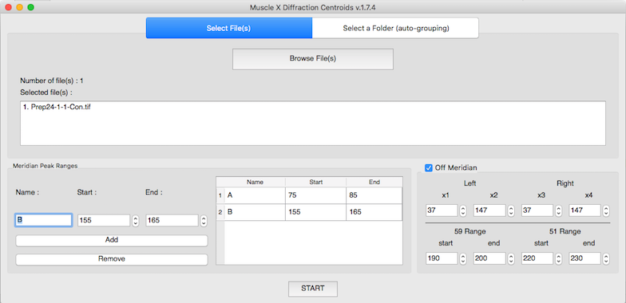
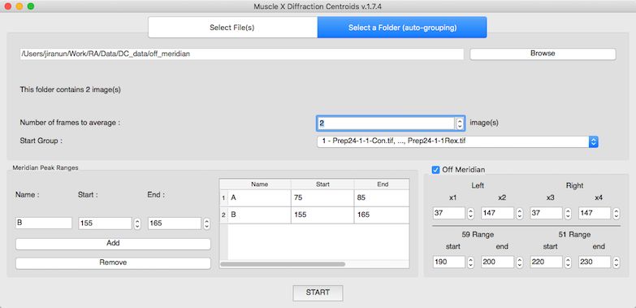
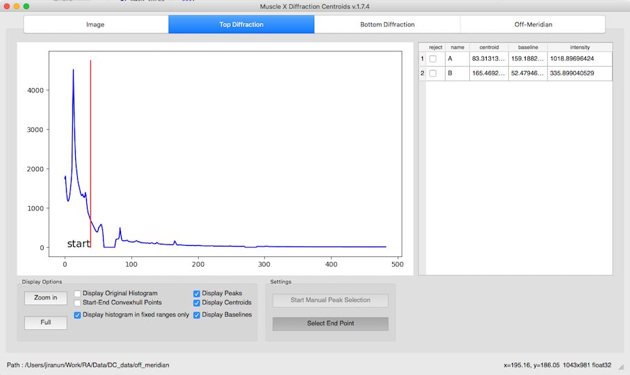
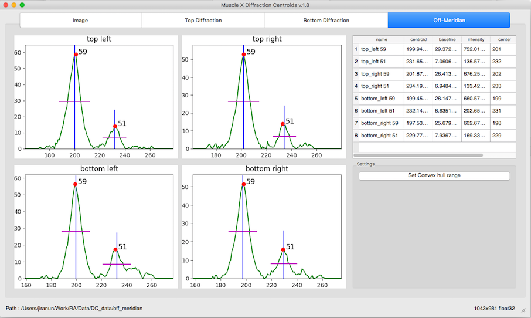
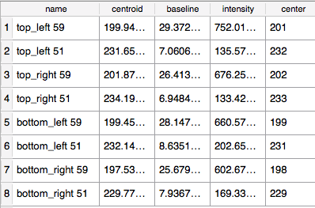
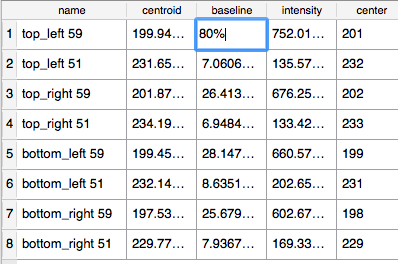
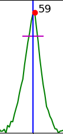
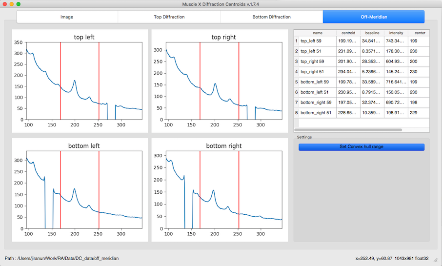

# How to use

Once the program is run, you will see the window below

There are 2 options for averaging input files, manual-grouping and auto-grouping, For manual-grouping, you can select a single file or multiple files to average. For auto-grouping, you have to select a folder and select the number of frames to average. You can then select the first group to start processing.

After selecting input files, you have to add individual meridional  peak(s) by inputting its name, and approximate location by range (start and end) in pixels. Then, if you want to get information from the  59 and 51 Angstrom peaks for off-meridian area, you have to check  "Off Meridian" and input x1,x2,x3,x4, the approximate location of the 59 and 51 Angstrom peaks as ranges in pixels. x1,x2,x3, and x4 will be the distance from the meridian in pixels while peak 59,51 are the distance from the equator in pixels. 

After everything is set and START is pressed, you will see another window pops up as below

There are 4 tabs if the Off Meridian is checked. Otherwise, there will be 3 tabs.

## Image
In this tab, you will see the input image, 2 graphs and a number of options on the right. The 2 graphs are the top and bottom meridional projections. In the option frame on the right, you will see 3 sections, Images, Display Options, and Calculation Settings.

### Images
In this section, you will see the name of images. In the example above, there is only 1 image selected, so it displaysonly 1 file.

### Display Options
In this section, you can set what you want to see in the image, set min or max intensities, zoom in and full zoom out. To zoom in the image, you have to click Zoom in Image button and draw a zoom rectangle in the image. You can also see mouse wheeling to zoom in and zoom out.

### Calculation Settings
In this section, you can do 
#### 1. Set the Center and Rotation Angle
Before setting manual rotation and center, it’s better to zoom the image to the area of the diffraction because it will be easier to set these parameters correctly. To set the rotation and center, you need to click 2 positions of the image. The first one will be a reflection peak on one side of the meridian, and the second one will be the corresponding (opposite) reflection peak on the other side of the meridian. To cancel, press ESC.

#### 2. Set the Rotation Angle
This assumes that the center of diffraction is correct. After the button is clicked, the program will allow users to select an angle by moving a line. Clicking on image when the line is on the meridian of the diffraction pattern will set manual rotation angle. To cancel, press ESC.

#### 3. Set the Meridional Area
The Meridional Area is the integrated area along the meridian. To set it, you need to click 2 positions in the image which are the left and right side of the box. To cancel, press ESC.

#### 4. Set the Left/Right Off-Meridian Area
Left Off-Meridian area is x1, and x2 while Right Off-Meridian is x3, and x4. These options will be available only when you check Off-Meridian. To set the area, you can do the same thing as Set Meridian Area. To cancel, press ESC.

## Top & Bottom Diffraction patterns

For both Top and Bottom Diffraction tabs, you will see the same GUI providing different information. The graph will be integrated intensity histogram along the meridian. Also, there are 2 sections at the bottom and result table on the right.

### Display Options
In this section, you can set what you want to see in the graph by checking boxes, and zoom in or full zoom out.

### Settings
In this section, you can set start and end of convex hull by pressing the button and click start and end location in the graph. After these points are set, the program will apply them to other images in the same folder.

### Results table
This table will display all information for each peaks : name, centroid, baseline, intensity(area). 

You can reject a peak by checking Reject check box. Also, you can change baseline by just typing the new baseline in the table

By default, the baseline will be set to 50% of the peak height. However, you can change it here by typing a new baseline value or percentage by putting '%' at the end.

## Off-Meridian
This tab will be displayed only when the Off-Meridian option is checked. In this tab, you will see result table, settings section and 4 graphs which are Top-left, Top-right, Bottom-left, and Bottom right integrated intensity inside off-meridian box. 

The table on the right contains all information for the 59 and 51 Angstrom peaks in  each quadrant. 

You can also change the baseline by typing the new value or percentage (default is 50%)

For example, if you set baseline to 80%, the result will be as below

Moreover, you can set start and end points for Convex hull background subtraction by pressing Set Convex hull range and click on a graph. This range will apply to all quadrants.

