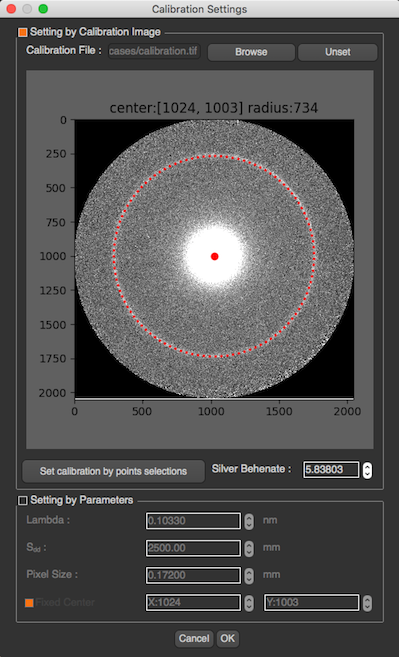
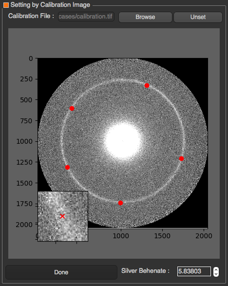

# Calibration Settings

When the calibration image selected, the program will try to fit a circle to the image. The center and radius will be shown above the image if the circle can be fitted.

However, if the circle cannot be fit or the circle is in the wrong position, you can also fit the circle manually by clicking on “Set manual calibration by point selections” button. After the button clicked you will see another image at the bottom left which is the zoom area of your cursor.

You will have to click at least 5 points on the ring position, and click Done when you finish. After setting appropriate Silver Behenate, and click OK, the image will be reprocess with a new calibration settings including center and d-spacing.

Also, you can manually set the calibration parameters which are λ, Sdd , and pixel size or fix the center location by input coordinates x,y. The center can also be fixed independently of the caliberation image. The fixed center checked indicates that the specified center will be used when we move to next image or process images in the folder.

These parameters are used to calculate d10 by 
