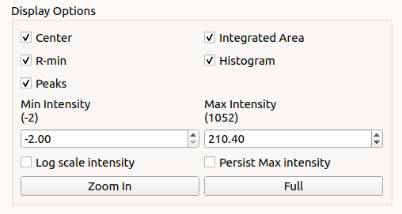
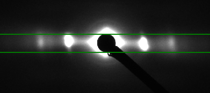
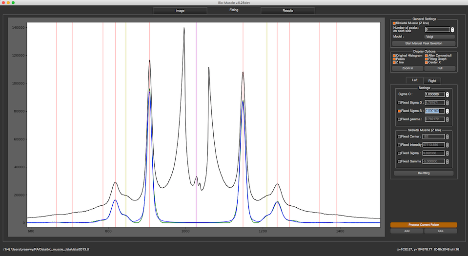
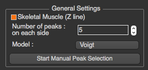
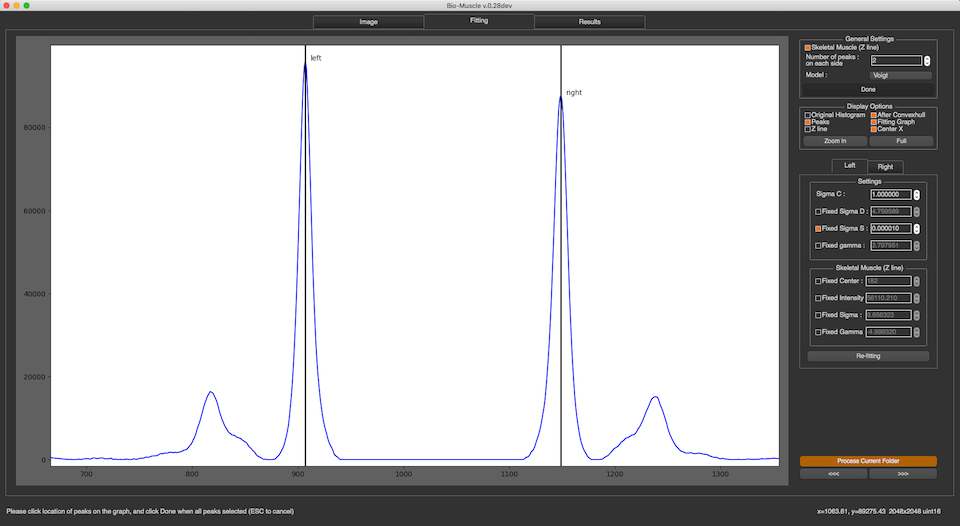
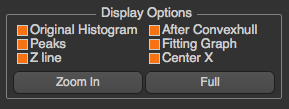
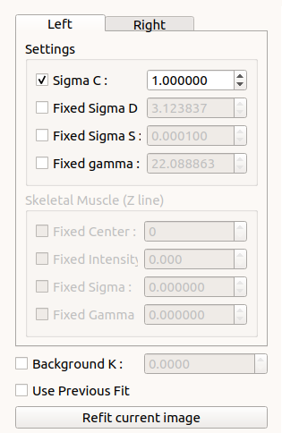
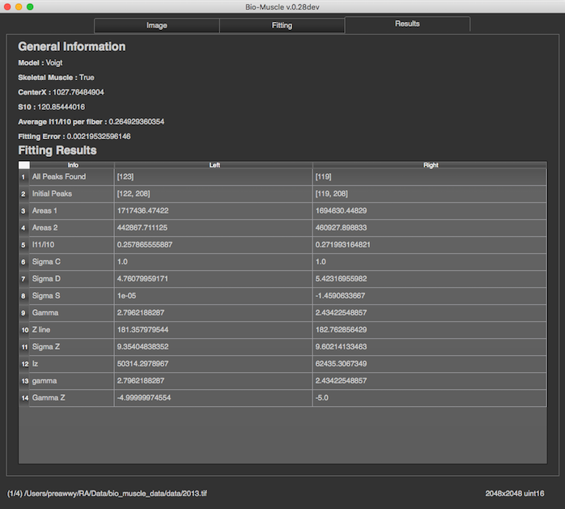

# How to use

Once the program run, you will see an input file dialog, so you can select the file you want to process. If you want to process multiple files in a folder, please select a file in that folder, and click “Process Current Folder”.

When the processing window opened, there are 3 tabs on the top, 
* [Image](#image)
* [Fitting](#fitting)
* [Results](#results)

## Image
In this tab, you will see the selected image, Display Options section, and Image Processing section, Reject check box, next button previous button, and Process This Folder button.

### Display Options
In Display Options section, you are able to select what you want to see in the image. All check boxes are all about displaying information in the image. In image above, 
* Center : blue dot 
* Integrated Area (Box Width) : green lines
* R-min : red dotted circle
* Histogram : white plot as original histogram and red line as fitting model
* Peaks : yellow lines

The check box Persist max intensity is used to persist the max intensity when we move to the next image.

 

You can also set min and max intensity for displayed image in this section. To zoom the image, you can click “Zoom In” button and select the zoom in area in the image, or using mouse wheeling in the image directly. This options in this section will not affect the image processing.
### Image Processing
[display_options](../../images/BM/img_proc.png)

In Image Processing section, you will see multiple buttons allow you to calibrate the image and set some properties manually.
#### Calibration Settings
After “Calibration Settings” is pressed, there’s a window popped up. This window will allow you to select the calibration image by clicking on Browse or setting parameters manually. See [Calibration Settings](../Calibration-Settings.html) for more details

#### Set Rotation and Center
Before setting manual rotation and center, it’s better to zoom the image to the area of the diffraction because it will be easier to set these parameters correctly. To set the rotation and center, you need to click 2 positions of the image. The first one will be a reflection peak on one side of the equator, and the second one will be the corresponding (opposite) reflection peak on the other side of the equator. To cancel, press ESC. 

#### Set Rotation Angle
This assumes that the center of diffraction is correct. After the button is clicked, the program will allow users to select an angle by moving a line. Clicking on image when the line is on the equator of the diffraction will set manual rotation angle. To cancel, press ESC. (Make sure that “Fixed Angle” is not checked) 

#### Set Manual R-min
After the button clicked, you will see the red circle when you move the cursor around. To set manual R-min, please click on image when the circle size is the size of R-min you want. To cancel, press ESC. 

#### Set Box Width (Integrated Area)
To set the integrated area, you need to click 2 positions of the image. The first one will be the start line, and the second one will be the end line. To cancel, press ESC. 

#### Blank image and Mask
This option is available on version 1.6 or upper. Click [Here](Blank-Image-and-Mask.html) to see more details

#### Fixed Angle
This feature will allow users to fixed rotation angle for every image which has not been processed. After the checkbox is checked, the manual rotation angle which is set by buttons will be ignored.

#### Fixed Box Width (Integrated Area)
This feature works in the same way as fixed angle, but the fixed value will be start and end position (pixel) of the box

#### Mode Orientation
This checkbox can be used after fitting all the images in the folder. When checked, the rotation angle used would be the mode of the rotation angles of all the images in the folder. This is persisted when we move to the next image.

## Fitting
In this tab, you will see the graph produced from the intensity histogram in the integrated area, and fitting information. 

### General Settings
In the section, you are able set necessary parameters for fitting process including skeletal muscle checkbox, number of peaks on each side, and fitting model. The model functions for the peaks currently supported are Voigtian and Gaussian. If the Number of Peaks selected are more  than the number of peaks, the program still tries to fit the model with the selected Number of Peaks.

In cases where the program misplaces the peak locations, you can do peak selection manually by clicking on “Start Manual Peak Selection”. After the button clicked, you can select the how many peak locations you want by clicking on the graph. However, it's sufficient to just select S10 of left and right side. Click “Done” when you are done. To cancel, press ESC.

### Display Options
In this section, you will be able to select what you want to see in the graph. All check boxes are all about displaying information in the graph. In the image above, 
* Original Histogram : black line
* After Convex hull : green line
* Peaks : red lines
* Fitting Graph (Best fit function graph) : blue line
* Z line : yellow line
* Center X : magenta line

You can also zoom-in to see more detail by the same mechanism as in Image tab. All options in this section will not affect the fitting results.

### Settings
In this section, once a setting is changed, the fit will be recalculated. You can manually configure and lock all parameters of fitting model including Sigma C, Sigma S, Sigma D, gamma and skeletal parameters. These parameters are independent on each side, so you have to choose the side by choosing left or right tab before setting these parameters. Press "Re-fitting" when you want to re-fitting will the new settings.

Diffraction data taken on integrating detectors such as CCD detectors will have read noise. This can result in a constant offset to the background subtracted diffraction peaks from zero. This can lead to systematic error("BAckgeos in your peak measurement. In this case it is possible to add a user selected constant offset ("Background K") that is added to the fitting function prior to fitting the data. In practice this number is selected as the number that provides the best "eyeball" fit to the residual background. Since this residual background often has some residual structure that is hard to model, the constant is not adjusted by the fitting process. The fitting parameters, number of peaks, skeletal line check box and background K are persisted when moved to the next image. The functioning of the three fitting buttons are as follows:
* Refit current image : This button refits the current image with the selected settings.
* Refit current folder : This button refits all the images in the current folder with the selected settings. Any change in the image processing parameters in not considered while fitting subsequent images.
* Reprocess and Refit current folder : This button refits all the images in the current folder with the selected settings as well as image processing parameters while fitting subsequent images.

The use previous fit checkbox allows the user to reuse the fitting values while refitting the model. For example, if 3 peaks are to be fitted, if use previous fit is checked, the fitting parameters currently obtained for 2 peaks is used as initial guess while fitting the model.

## Results
Important fitting results are shown in this tab. If the calibration parameters are set, the program will also show d10. 

## Parameter Editor
The Parameter editor tab displays all the fit parameters and their corresponding optimum values. As shown in the screenshot below, the columns in the parameter editor are as follows:
* Checkbox indicating whether the parameter was fixed (checked) or allowed to move (unchecked) between minimum and maximum values
* Name of the fitted parameter
* Optimal value of the parameter after fitting
* Minimum value of the parameter used while fitting
* Maximum Value of the parameter used while fitting

The user could further refine the fitting by fixing/unfixing any of the fit parameters, changing the values of the parameter and minimum and maximum value to be used. After making the corresponding changes, "Re-fit Parameters" uses these values as initial guess and refits the model. After refitting, the user can have a look at the results or fitting by switching to the appropriate tab. 

NOTE: The changes made in parameter editor would be temporary and will not be persisted when moved to next image.

Additional features:
* Add 'S' peak parameter - This button is used to add an extra fitting parameter 'S' for each peak. This paramaeter is added to the center of the corresponding peak.
* Enable Extra Gaussian - This button adds three new parameters for the extra gaussian namely, extraGaussCenter, extraGaussSig and extraGaussArea. These parameters would be used to add an extra gaussian to the fitting.

