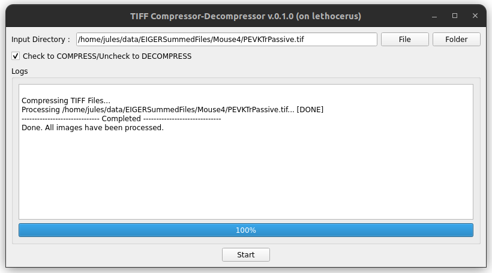

# TIFF Compressor-Decompressor

There are currently two versions of the program: a standalone program and the code execution program.

## Standalone program

The standalone program can be run in Interactive mode or in Headless mode. As its name suggests, this program is NOT part of MuscleX, and can be found on the [Utilities page](../../utilities.md).

### Interactive mode

The interactive mode displays a window where you can choose an input file or a folder (for a folder, it will compress/decompress all the tif files inside of it). The output folder is the same as the input, which means the files are modified in place/overwritten.
You can select if you want to compress the files or decompress them using the associated checkbox.
You can then press 'Start' to convert the images. You can stop the process at any moment by clicking on 'Stop'.

### Headless mode

The headless mode works exactly as the Code Execution program: just run `tif-compressor` followed by the commands described in the next part.

## Code Execution program

The code execution program is composed of a script located inside the MuscleX code. You need access to the source code to be able to run this version of the compressor. The file is located in the "utils" folder of the MuscleX code.

### Compress/Decompress TIFF files
The script will convert the tiff files to compressed/original format.

- Source Code: [https://github.com/biocatiit/musclex/blob/master/musclex/utils/tif_compressor.py](https://github.com/biocatiit/musclex/blob/master/musclex/utils/tif_compressor.py)

#### How to use

Execute the following command:

`python3 tif_compressor.py`

Note: You can run multiple compression by including multiple files or folders after the `-i` or `-f` tag.
