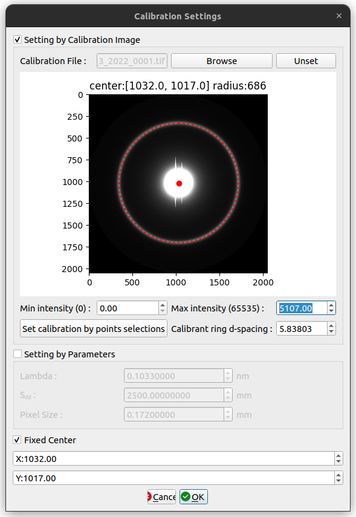
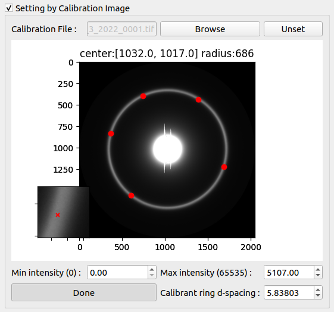

# Calibration Settings

A calibration image is a shot of a membrane sample that gives a ring in the diffraction pattern at a known spacing in inverse nm.
By fitting this ring to a circle you can refine a center and you can use the radius of the ring to convert spacings in pixels to spacings in nm.

## Setting by Calibration Image

When the box is selected, you can choose a calibration image and the program will try to fit a circle to the image. The center and radius will be shown on it if the circle can be fitted.

However, if the circle cannot be fitted or the circle is in the wrong position, you can also fit the circle manually by clicking on “Set manual calibration by point selections” button. Once the button clicked, you will see another image at the bottom left which is the zoom area of your cursor. To select a point on the ring, you need to click a first time on the image (approximate click), then a second time on the zoom area (precise click).

You will have to click at least 5 points on the ring position, and click Done when you finish. After setting appropriate calibrant ring d-spacing, and clicking OK, the image will be reprocessed with new calibration settings including center and d-spacing.

## Setting by Parameters

You can also manually set the calibration parameters which are λ, Sdd and Pixel size.
These parameters are used to calculate d10 by 

## Fixed Center
 
The center can also be fixed independently of the calibration image. The fixed center checked indicates that the specified center will be used when we move to the next image or process the current folder.

## Manually Select Detector

Having a detector corresponding to the images used might improve the results obtained with MuscleX.

You can manually select the detector used for the experiment. If you don't the detector will be selected automatically by using the size of the image. The list provided is from the pyFAI's Detectors registry (some name might be repetitive but they point to the same detector). However, if the detector you selected does not correspond to the image provided, the program will fall back to our default detector.

